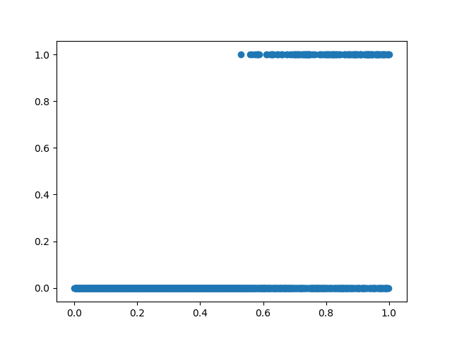

<!--
$theme: gaia
template: invert
-->

# Day 5: Classification Algorithms

---

### Why Classification?

To date, we have focused on *regression* algorithms. While useful, there are some features of regression tools worth noting:

- Evaluate continuous dependent variables well
- Struggle on discrete dependent variables
- Do not understand different "groups" of data, just one sliding scale in $\mathbb{R}$

---

### When Classification Instead of Regression?

When we have **discrete** dependent variables
- Binary variables
- Categorical Data
- When there is no clear dependent variable, or when we don't exactly know what we are looking for

---

### Regression vs Classification

Regression asks:

- What is the predicted price of commodity $x$ in the next period?

Classification asks

- Does the price of commodity $x$ rise or fall in the next period?

---

### Classifying - Histograms

<!-- 

 -->

Let's imagine that we want to classify observations based on a binary dependent variable, $y$.

- Two possible outcomes
- We classify each observation based on which outcome is most likely

$$ p(y|x) \geq .5 \Rightarrow \hat{y}=1 $$
$$ p(y|x) < .5 \Rightarrow \hat{y}=0 $$

---

### Classifying - Histograms

---

### Classifying - Histograms

---

### Classifying - Histograms

---

### Classifying - Histograms

---

### Classifying - Histograms

---

### Classifying - Histograms

Is there a more efficient way?
- Imagine we only divide variables in half
- How many discrete bins of data would exist if we looked at each of 16 variables in this way?

---

### Classifying - Histograms

Is there a more efficient way?
- Imagine we only divide variables in half
- How many discrete bins of data would exist if we looked at each of 16 variables in this way?
	- $2^{16} = 65,536$ possible bins
	- We would then need 65,536 observations at the **minimum** to know how to treat each cell
- This is **not** efficient

--- 

### Classification - A Better Algorithm

If we don't want to use histograms, what tools are available?
- Logistic Regression
- Na&iuml;ve Bayes Classifier
- Nearest Neighbor Algorithms
- Decision Trees
- Support Vector Machines
- Neural Networks

---

### Classification - Logistic Regression

---

### What about Linear Probability Models?

 

- Just use OLS to estimate likelihood of outcome
- Has the advantage of simplicity
- Also has the problem of assuming continuity of outcomes (which is not true in a classification problem)

---

### Logistic Regression

 

- 

---

### Logistic Regression

 

