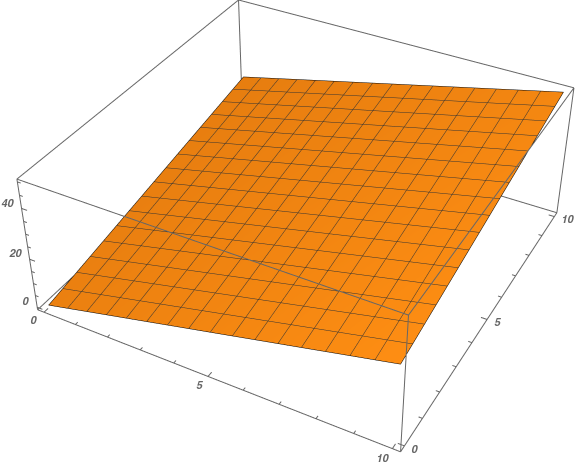
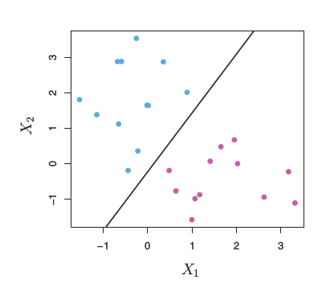

<!--
$theme: gaia
template: invert
-->

# Day 13: Support Vector Machines

---

### First, Hyperplanes

With your group, take 5 minutes or so to answer the following questions:

1. How do you divide a 1-Dimensional space into two?
2. How do you divide a 2-Dimensional space into two?
3. How do you divide a 3-Dimensional space into two?

---

### Hyperplanes

**Hyperplanes** sound fancy, but they are just generalizations of concepts that you are already familiar with. 

When we divide a 1-Dimensional space into two, we just need to choose a **point** (a 0-Dimensional object) at which we can divide our line (a 1-Dimensional object).

---

### Hyperplanes

We divide a 2-Dimensional space using a **line** (1-D) 

---

### Hyperplanes
We use a **plane** (2-D) to divide our 3-D space:

---

### Hyperplanes

 

A **hyperplane** is an $(n-1)$-dimensional object in $n$-dimensional space. It can be used to divide the space into two distinct segments defined by their position relative to the hyperplane.

A hyperplane can be defined by a vector of length $(n-1)$, describing the slope of the hyperplane in each dimension.

---

### Linear Regression and Hyperplanes

When we fit a linear model, we solve the following problem:

$$ min_{\alpha, \beta}\; \sum_{i=1}^N (y_i - x_i \beta)^2 $$

This problem is really just a statement of **finding the hyperplane that minimizes the squared error of prediction for all observations**

---

### Support Vector Machines

SVMs are an **opposite** of linear regression. 
- **Linear regression**: find a hyperplane that best matches our observations as a predictor
- **SVM**: create a hyperplane that is **as far as possible** from our observations while placing observations of each class on opposite sides of the hyperplane

---

### Support Vector Machines

With two different classes, we want to separate as well as possible based on our inputs ($X_1$ and $X_2$ above)