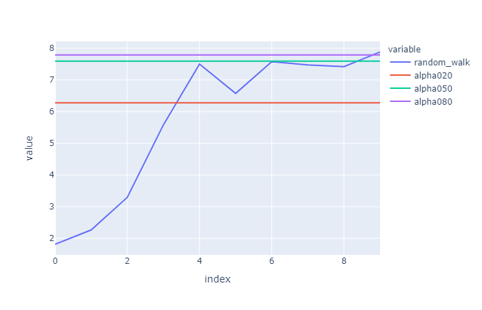
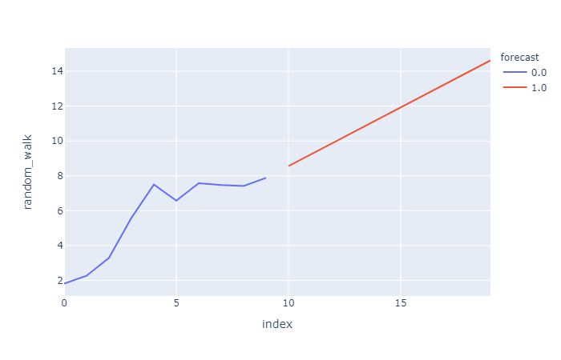
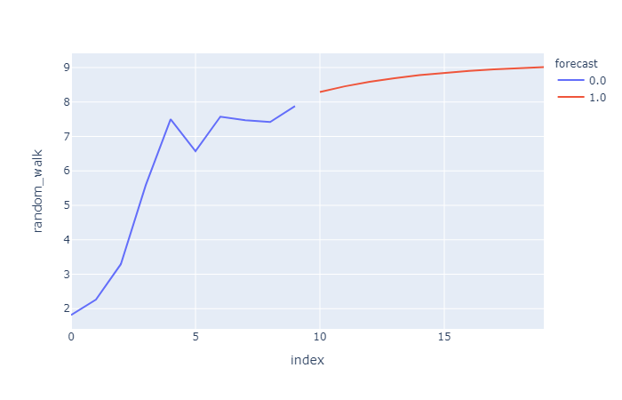

# ECON 8310 - Business Forecasting

---

**Instructor**: 
Dustin White
Mammel Hall 332G

**Office Hours**:
By appointment (remote or in-person!)

**Contact Info**:
drwhite@unomaha.edu

<!-- ---

# Quick Note

You will be expected to program in class every week. If you haven't taken ECON 8320 (Tools for Data Analysis), this means that you will need to spend extra time outside of class:
- [Udacity.com](udacity.com) is an excellent learning resource
- [Datacamp.com](datacamp.com) is another great resource to get you started
- Remember: if you need to, spend time outside class practicing your coding (by time I mean **hours**) -->

---

# Quick Note

Your ability to use code to solve problems will be the basis for your grade in this course, so if you cannot commit the time to practice coding, you are not likely to pass this class.

---

# Grade Details


|Score|Grade|Score|Grade|
|:-:|:-:|:-:|:-:|
|\>94%|A|72.5-77.4|C|
|90-93.9|A-|70-72.4|C-|
|87.5-89.9|B+|62.5-69.9|D|
|82.5-87.4|B|60-62.5|D-|
|80-82.4|B-|\<60|F|
|77.5-79.9|C+|

---

# Grade Details


|Assignment| Percent of Grade|
|:-:|:-:|
|Lab Work|30%|
|Reading Assignments | 20% |
|Participation | 20% |
|Course Project| 20% |


---

# My Expectations

<!-- - (You will be expected to learn to program during this course if you do not already know how) -->
- Plan on spending **all of our time in lab** working on homework and projects and refining your predictions
- **Take charge** of your assignments and projects; they will be open-ended!

---

# Expectations of Me

- I will work through examples of code in class
- I will be available during lab and office hours to help you with assignments
- I will revise the course material as needed to suit your interests
    - Just added a bunch of new models last year!


---

# Introduction to Forecasting

---


# What is Forecasting?

Forecast: "to predict or estimate (a future event or trend)" -- Google Dictionary

- Predict weather patterns
- Estimate the quantity of stock required during a certain time-span
- Generally, determine the most likely outcome of a stochastic process based on previous events
- **Learn from observed patterns**


---

# Forecasting is just __fancy trendlines__

In this course, we want to learn how to predict outcomes based on the information that we already possess. 


---


# Forecasting

<br>

- Time Series modeling
- Predictive modeling using tree-based ML models
- Neural Networks
- Bayesian models for complex processes
- **Choosing the best model for the job**

---

# Exponential Smoothing
###### For reference, read [Hyndman and Athanasopoulos' Chapter 7](https://otexts.com/fpp2/expsmooth.html)

---

# You know what they say about assumptions...

Let's start term with an assumption-free* model
<br><br>
###### \* almost assumption free...

---

# Small $n$, big problem

Let's say we are just getting started collecting data, and we have a very small number of observations, but still need to make a forecast.

- What if you just have two observations?

We can generate some data and explore our first model

---

# A random walk, simulated

```python
import numpy as np
import plotly.express as px

np.random.seed(seed=0)

def step(prev=0):
    return prev + np.random.normal(loc=0.05, scale=1.0)

def walk(steps=10):
    data = []
    for i in range(10):
        if i==0:
            data.append(step())
        else:
            data.append(step(data[i-1]))
    return data
```
---

# Introducing...

**Exponential Smoothing**! A model that doesn't care what your data look like, or even how much you have!

---

# Simple Smoothing

Our first version of this model is super simple:
1) Take a weighted average of the data
2) Forecast that value!

---

# Simple Smoothing

How do we weight it? With $\alpha$!

$$ y_{t+1} = \alpha y_{t} + \alpha(1-\alpha) y_{t-1} + \alpha(1-\alpha)^2 y_{t-2} + ... $$

The weights on our model sum asymptotically to 1

<br>

**Can YOU code it?**

---

# Simple Smoothing - The Code

```python
from statsmodels.tsa.api import ExponentialSmoothing
from statsmodels.tsa.api import SimpleExpSmoothing
import pandas as pd

data = walk(10)

alpha020 = SimpleExpSmoothing(data).fit(
                    smoothing_level=0.2,
                    optimized=False)

alpha050 = SimpleExpSmoothing(data).fit(
                    smoothing_level=0.5,
                    optimized=False)

alpha080 = SimpleExpSmoothing(data).fit(
                    smoothing_level=0.8,
                    optimized=False)

level2 = alpha020.forecast(1)
level5 = alpha050.forecast(1)
level8 = alpha080.forecast(1)

print(level2, level5, level8)
```

---

# Simple Smoothing - The Code (#2)

```python
levels = pd.DataFrame([data, 
[float(level2) for i in range(10)], 
[float(level5) for i in range(10)], 
[float(level8) for i in range(10)]]).T

levels.columns = ['random_walk', 'alpha020', 'alpha050', 'alpha080']

px.line(levels, y=['random_walk', 'alpha020', 'alpha050', 'alpha080'])
```


---



---

# Solving problems!

Simple is good! The simplest model is to set $\alpha=1$, so that we only care what the most recent value is, and use it as our forecast.
- Has the added advantage of working with $n=1$!

We can also use an "unweighted" average ($\alpha=0$)

---

# Not enough usefulness

So that's cool and simple, but what if I want a forward-looking forecast?

- Exponential smoothing can still help!

---

# Smoothing plus Trendline

```python
# Linear trend
trend = ExponentialSmoothing(data, trend='add').fit()

trends = pd.DataFrame([data + list(trend.forecast(10)), [0]*10 + [1]*10]).T
trends.columns = ['random_walk', 'forecast']
                       
px.line(trends, y='random_walk', color='forecast')
```

---

# Smoothed Trends

Just like we could smooth past values, we can also create a smoothed trendline to include in our forecast!

---



---

# If present trends continue...

We know they never do, so we can dampen (weaken) the trend over time

---

# Damped Trends

```python
# Linear trend WITH DAMPING
trend = ExponentialSmoothing(data, trend='add', damped=True).fit()

trends = pd.DataFrame([data + list(trend.forecast(10)), [0]*10 + [1]*10]).T
trends.columns = ['random_walk', 'forecast']
                       
px.line(trends, y='random_walk', color='forecast')
```

---




---

# Seasonality? You got it!

Exponential Smoothing also allows for seasonality. While our current data doesn't have seasonal effects (it's a random walk), here is how we accomodate seasonality:

```python
# Linear trend with seasonality
trend = ExponentialSmoothing(employment, 
            trend='add', 
            seasonal='add', 
            seasonal_periods=12).fit()
            
# Linear trend with damping and seasonality
dampedTrend = ExponentialSmoothing(employment, 
            trend='add', 
            seasonal='add', 
            damped=True, 
            seasonal_periods=12).fit()
```

---

# Summary

Exponential smoothing
- Requires a single time series
- Allows for models with $n\geq1$ (so pretty much any data)
- Handles trends
- Can dampen trends
- Handles seasonality

ES does NOT
- Do multivariate models

---

# Lab Time!