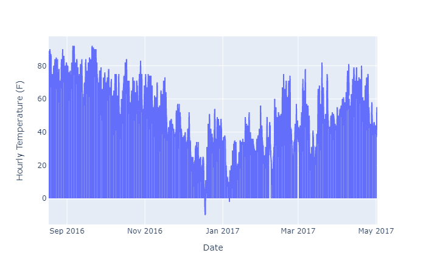
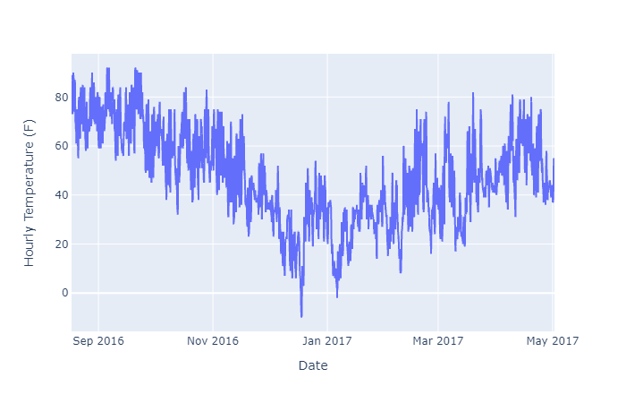
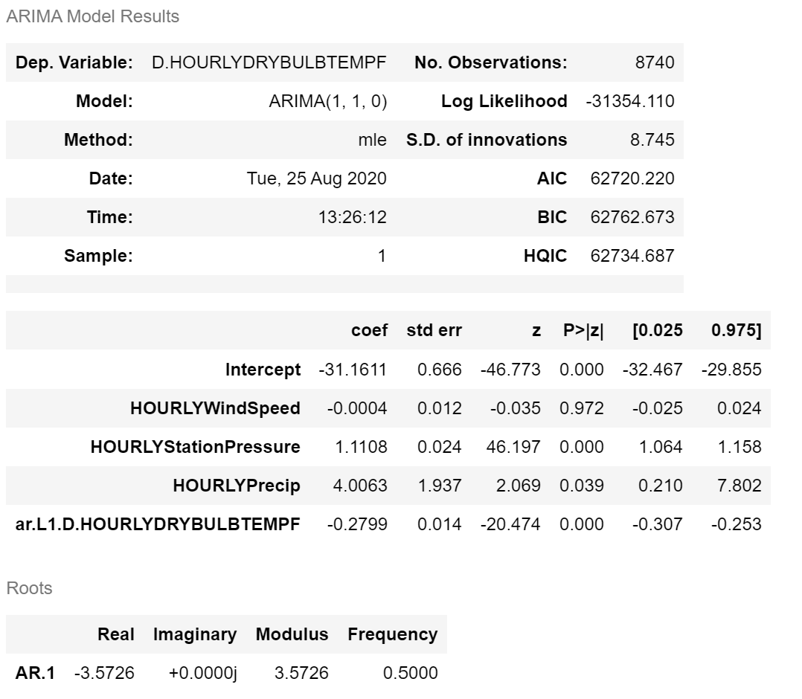
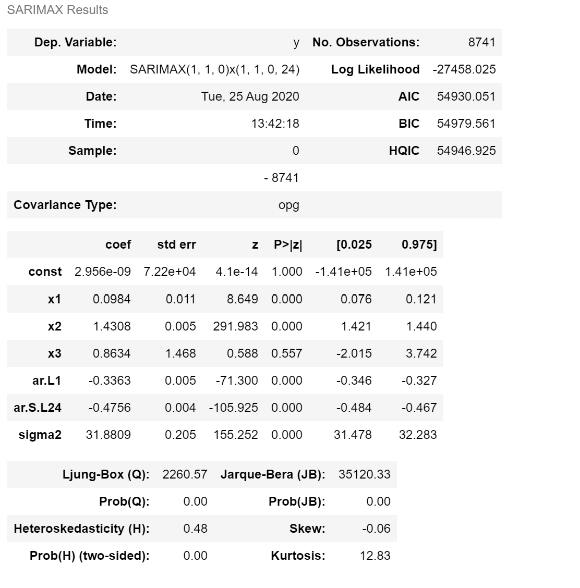

# ECON 8310 - Business Forecasting

---

**Instructor**: 
Dustin White
Mammel Hall 332M

**Office Hours**:
By appointment (remote or live options available)

**Contact Info**:
drwhite@unomaha.edu

<!-- ---

# Quick Note

You will be expected to program in class every week. If you haven't taken ECON 8320 (Tools for Data Analysis), this means that you will need to spend extra time outside of class:
- [Udacity.com](udacity.com) is an excellent learning resource
- [Datacamp.com](datacamp.com) is another great resource to get you started
- Remember: if you need to, spend time outside class practicing your coding (by time I mean **hours**) -->

---

# Quick Note

Your ability to use code to solve problems will be the basis for your grade in this course, so if you cannot commit the time to practice coding, you are not likely to pass this class.

---

# Grade Details


|Score|Grade|Score|Grade|
|:-:|:-:|:-:|:-:|
|\>94%|A|72.5-77.4|C|
|90-93.9|A-|70-72.4|C-|
|87.5-89.9|B+|62.5-69.9|D|
|82.5-87.4|B|60-62.5|D-|
|80-82.4|B-|\<60|F|
|77.5-79.9|C+|

---

# Grade Details


|Assignment| Percent of Grade|
|:-:|:-:|
|Lab Work|30%|
|Reading Assignments | 20% |
|Participation | 20% |
|Midterm and Final Projects| 20% |


---

# My Expectations

<!-- - (You will be expected to learn to program during this course if you do not already know how) -->
- Plan on spending **all of our time in lab** working on homework and projects and refining your predictions
- **Take charge** of your assignments and projects; they will be open-ended!

---

# Expectations of Me

- I will work through examples of code in class
- I will be available during lab and office hours to help you with assignments
- I will revise the course material as needed to suit your interests
    - Just added a bunch of new models last spring!


---

# Lecture 1: Intro and OLS Review

---


# What is Forecasting?

Forecast: "to predict or estimate (a future event or trend)" -- Google Dictionary

- Predict weather patterns
- Estimate the quantity of stock required during a certain time-span
- Generally, determine the most likely outcome of a stochastic process based on previous events
- **Learn from patterns**


---

# Forecasting is just __fancy trendlines__

In this course, we want to learn how to predict outcomes based on the information that we already possess. 


---


# Forecasting

<br>

- Time Series modeling
- Neural Networks
- Predictive modeling using machine learning
- Bayesian models for complex processes
- Choosing the best model for the job


---


# Remembering OLS...

- Ordinary Least Squares (OLS) is the foundation of regression analysis, and an excellent starting point for this course
- Estimates the expected outcome ($\hat{y}$) given the inputs ($x$)


---


# A Little More Remembering...

- Calculating coefficient standard errors informs us about the level of noise in the data
- $R^2$ and Adjusted $R^2$ tell us how much of the total variation our model accounts for

---

# OLS in Statsmodels

```python
import statsmodels as sm
# Declare the model, and create an instance of the OLS
#  class
model = sm.OLS(endog = y, exog = x)
# Fit the model, optionally using specific parameters
modelFit = model.fit()
```

We can easily use just a couple lines to implement an Ordinary Least Squares regression model. We simply declare the model, then fit it.

We can also use the `.summary()` and `.predict()` methods on fitted models to view regression tables or to make predictions with new observations.

---

# Transforming OLS for Time Series Data

What if we take yesterday's $y$ value and make it our exogenous variable? The model would be written

<br>

$$ y_{t+1}=\alpha + \beta_t \cdot y_t + \epsilon $$

<br>

This model violates our OLS model assumptions! We need tools to overcome this 

---

# Autocorrelation

One of the primary assumptions of the OLS model is that

$$Cov(\epsilon_t,\epsilon_s) = 0, \;\forall\; t \neq s $$

This assumption is clearly **not** valid in any time series that can be meaningfully modeled.

Let's look at some data to find out why.

---

# Autocorrelation


---

# Autocorrelation


We need to find a model that can eliminate the autocorrelation almost always seen in time series data.

---

# Autoregressive Models

AR models are based on the premise that  deviation from the underlying trend in the data persists in **all future observations**.


$$ y_{t} = \alpha + \sum_{i=1}^p \rho_i \cdot y_{t-i} + \epsilon_t $$


Here $\rho$ is the correlation term between periods and $\epsilon$ is an error (shock) term

---

# AR Models

- We need to consider lagged observations of $y$ in order to predict future outcomes
- The number of lags that we include is the **order** of our AR model
	- The model is an AR(p) Model, where p is the order of the model

---

# AR Models

- The AR coefficients tell us how quickly a model returns to its mean
	- If the coefficients on AR variables add up to close to 1, then the model reverts to its mean **slowly**
	- If the coefficients sum to near zero, then the model reverts to its mean **quickly**

---

# Moving Average Models

While an AR($\cdot$) model accounts for previous values of the dependent variable, MA($\cdot$) models account for previous values of the **error** terms:

$$ AR(p) = \alpha + \sum_{i=1}^p \rho_i\cdot y_{t-i} + \epsilon_t $$
$$ MA(q) = \alpha + \sum_{i=1}^q \theta_i\cdot \epsilon_{t-i} + \epsilon_t $$

---

# Moving Average Models

An MA model suggests that the current value of a time-series depends linearly on previous error terms.
- Current value depends on how far away from the underlying trend previous periods fell
- The larger $\theta$ becomes, the more persistent those error terms are

---

# Moving Average Models

- AR models' effects last infinitely far into the future
	- Each observation is dependent on the observation before
- In an MA model, the effect of previous periods only persist for $q$ periods 
	- Because each error is uncorrelated with previous errors
---

# Integrated Models

Integration occurs when a process is non-stationary. A non-stationary process is one that contains a linear time trend. One example might be a long-term series of stock prices:


---

# Integrated Models

We need to ensure that our data is stationary. To do so, we need to remove any time-trend from the data.
- This is typically done through differencing

$$ y^s_i = y_i - y_{i-1} $$

where $y^s_t$ is the stationary time series based on the original series $y_t$


---

# Integrated Models

Here,  the time trend has been differenced out of the data:


---

# Integrated Models

The Integration term $d$ represents the number of differencing operations performed on the data:
- I(1): $y^s_t = y_t - y_{t-1}$
- I(2): $y^s_t = (y_t - y_{t-1}) - (y_{t-1} - y_{t-2})$

Where an I(2) model is analogous to a standard difference-in-differences model applied to time-series data.


---

# Putting it Together

In order to account for all the problems that we might encounter in time series data, we can make use of ARIMA models.

**A**uto**R**egressive **I**ntegrated **M**oving **A**verage models allow us to
- Include lags of the dependent variable
- Take differences to eliminate trends
- Include lagged error terms


---

# ARIMA in Python

```python
# Import needed libraries
import pandas as pd
import numpy as np
import statsmodels.api as sm
import statsmodels.tsa.stattools as st
import plotly.express as px

# Read data, then set the index to be the date
# NOTE: make the file a single line!!
data = pd.read_csv("https://github.com/dustywhite7/Econ8310/blob/master/
DataSets/pollutionBeijing.csv?raw=true")

data['datetime'] = pd.to_datetime(data['datetime'], 
	format='%Y-%m-%d %H:%M:%S')
data.set_index(pd.DatetimeIndex(data['datetime']), 
	inplace=True)
data['logpm'] = np.log(data['pm2.5'])
```
---

# ARIMA in Python
```python
# Plot the data
px.line(data, x='datetime', y='logpm',
       labels = {
           'datetime' : 'Date',
           'logpm' : 'Logged Pollution Level'
       })
```

---

### ARIMA in Python

<br>


---

# ARIMA in Python
```python
# Plot the DIFFERENCED data

data['pmdiff'] = data['logpm'].diff()


px.line(data, x='datetime', y='pmdiff',
       labels = {
           'datetime' : 'Date',
           'pmdiff' : 'Differenced and Logged Pollution Level'
       })

```

---

# ARIMA in Python


---

# Testing for Stationarity

We can use the **Augmented Dickey-Fuller Test** to determine whether or not our data is stationary.

- H$_0$: A unit root is present in our data
- H$_A$: The data is stationary

This can help us to determine whether or not differencing our data is required or sufficient for inducing stationarity.

---

# Testing for Stationarity

We can use the **Augmented Dickey-Fuller Test** to determine whether or not our data is stationary.

```python
>>> st.adfuller(
>>> 	data['pm2.5'][-250:], maxlag=12)

(-3.1576359480752445, # The test statistic
 0.022571607041567278, # The p-value
 2, # Number of AR lags in model
 247, # Number of obvservations
 {'1%': -3.4571053097263209, 
  '10%': -2.5730443824681606, # The 1%, 5%, and 10%
  '5%': -2.873313676101283},  # thresholds
 2272.5419900847974) # The model information criterion
```

In this case, we can reject the unit-root hypothesis!

---

# Fitting the ARIMA model

```python
import statsmodels.api as sm

model = sm.tsa.ARIMA(np.log(data["pm2.5"]), (1,1,0)) 
		  # specifying an ARIMA(1,1,0) model
reg = model.fit() # Fit the model using standard params
res = reg.resid   # store the residuals as res
```

---

# ARIMA + X

We can improve on the ARIMA model in many cases if we use ARIMA**X** (ARIMA with e**X**ogenous variables) models to include exogenous regressors in our estimations!

---

# ARIMAX

Let's use some weather data to get started:

```python
import pandas as pd
import numpy as np
import patsy as pt
import statsmodels.api as sm
import statsmodels.tsa.stattools as st
import plotly.express as px

# NOTE: Make the string a single line again!
data = pd.read_csv("https://github.com/dustywhite7/Econ8310/
blob/master/DataSets/omahaNOAA.csv?raw=true")[-(365*24):]
		# We are keeping only the last 365 days
```

---

# ARIMAX

```python
px.line(data, x='DATE', y='HOURLYDRYBULBTEMPF',
       labels = {
           'DATE' : 'Date',
           'HOURLYDRYBULBTEMPF' : 'Hourly Temperature (F)'
       })
```

---

# ARIMAX



---

# ARIMAX

We have a lot of erroneous entries, and they're all recorded as 0!

```python
data['cleanTemp'] = data['HOURLYDRYBULBTEMPF'].replace(0, method='pad')

px.line(data, x='DATE', y='cleanTemp',
       labels = {
           'DATE' : 'Date',
           'cleanTemp' : 'Hourly Temperature (F)'
       })
```

---

# Much Better!



---

# ARIMAX

```python
eqn = "HOURLYDRYBULBTEMPF ~ HOURLYWindSpeed + " + 
"HOURLYStationPressure + HOURLYPrecip"
        
y, x = pt.dmatrices(eqn, data = data)

# The exog argument permits us to include exogenous vars
model = sm.tsa.ARIMA(y, order=(1,1,0), exog=x)
reg = model.fit(trend='nc', method='mle', 
		maxiter=500, solver='nm')
reg.summary()
```

---



---

# SARIMAX

Where can we go when we have cyclical data?
- We can introduce "seasonality" into our model

The Seasonal Autoregressive Integrated Moving Average Model with Exogenous Regressors (SARIMAX) is designed to deal with this kind of data and model.


---

# SARIMAX

We know that temperatures fluctuate daily (even though we have attempted to difference this out)

```python
model = sm.tsa.SARIMAX(y, order=(1,1,0),
		seasonal_order=(1,1,0,24), exog=x)
# trend='c' indicates that we want to include a 
#   constant/intercept term in our regression
reg = model.fit(trend='c', maxiter=500, solver='nm')
reg.summary()
```

Here, we need to include terms for our **seasonal** AR, I, and MA terms, as well as the periodicity of our data (24 observations per day).

---



---

# Forecasting ARIMAX/SARIMAX

When we forecast based on models with exogenous variables, we need to include those variables as an argument to the forecast method.

```python
# Generating our Forecast
fcst = reg.forecast(steps=10, exog=x[-10:]) 
		     # Generate forecast
```


---

# Lab Time!


<!-- ---


### Bonus Exercise

Form a group (of 3-4 people). Work together to write a function that can take an arbitrary Data Frame (imported via `pandas` and print an OLS Regression table.

hint:
```python
def myOLS(data, regression_equation):
    ...
```

Links: [t-stats in Scipy](https://docs.scipy.org/doc/scipy-0.14.0/reference/generated/scipy.stats.t.html)

Next week, we will start using pre-built libraries -->
