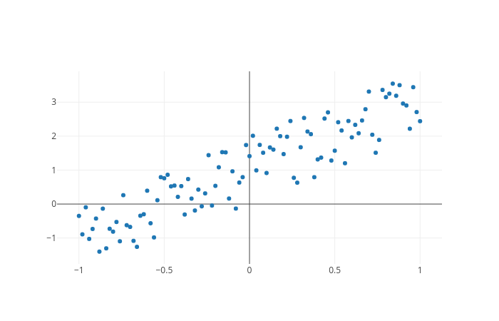
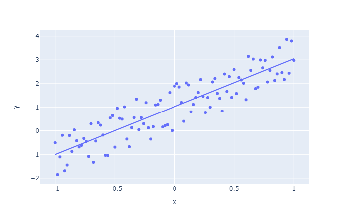

# ECON 8310
#### Business Forecasting

---

<br>

**Instructor**: 
Dustin White
Mammel Hall 332M

**Office Hours**:
Mondays 3-5 PM, or by appointment

**Contact Info**:
drwhite@unomaha.edu

---

# Quick Note

You will be expected to program in class every week. If you haven't taken ECON 8320 (Tools for Data Analysis), this means that you will spend extra time outside of class:
- [Udacity.com](udacity.com) is an excellent learning resource
- [Datacamp.com](datacamp.com) is another great resource to get you started
- Remember: if you need to, spend time outside class practicing your coding (by time I mean **hours**)

---

# Quick Note

<br>

Your ability to use code to solve problems will be the basis for your grade in this course, so if you cannot commit the time to practice coding, you are not likely to pass this class.

---

# Grade Details


|Score|Grade|Score|Grade|
|:-:|:-:|:-:|:-:|
|\>94%|A|72.5-77.4|C|
|90-93.9|A-|70-72.4|C-|
|87.5-89.9|B+|62.5-69.9|D|
|82.5-87.4|B|60-62.5|D-|
|80-82.4|B-|\<60|F|
|77.5-79.9|C+|


---

# Grade Details

<br>
<br>

|Assignment| Percent of Grade|
|:-:|:-:|
|Lab Work|36%|
|Reading Assignments | 12% |
|Midterm Exam| 25% |
|Final Exam| 27% |

Your overall grade will be out of 1000 points, so the math will be easy! (10 pts = 1%)

---

# My Expectations

- (You will be expected to learn to program during this course if you do not already know how)
- Plan on spending all of our time in lab working on homework and refining your predictions
- **Take charge** of your assignments; they will be open-ended!

---

# Expectations of Me

- I will work through examples of code in class
- I will be available during office hours to help you with assignments
- I will revise the course material as needed to suit your interests


---

# Lecture 1: Intro and OLS Review

---


# What is Forecasting?

Forecast: "to predict or estimate (a future event or trend)" -- Google Dictionary

- Predict commodity pricing
- Estimate the quantity of stock required during a certain time-span
- Determine the most likely outcome of a stochastic process based on previous events
- **Learn from patterns**


---

# Quick Forecast

```python
import numpy as np
import plotly.express as px

x = np.linspace(-1, 1, 101)
y = 2 * (x + np.random.rand(101))

fig = px.scatter(
    x = x,
    y = y
    )

fig.show()
```


---

# What just happened??
```python
import numpy as np
import plotly.express as px
```

These are our import statements

- We import "libraries" into Python that enable us to do tons of cool things
- In this case, we import numeric functions and the ability to render plots


---


# What just happened??

```python
x = np.linspace(-1, 1, 101)
y = 2 * (x + np.random.rand(101))
```

Next, we generate all our `x` values, and our `y` values (a random process based on those x values)

- There are 101 elements in both the `x` and `y` vectors


---


# What just happened??

<br>

```python
fig = px.scatter(
    x = x,
    y = y
    )

fig.show()
```

Finally, we generate a plot using the `x` and `y` vectors as coordinates, and tell Python to show us the plot


---


# Should look like:




---

# Quick Forecast

```python
fig = px.scatter(
    x = x,
    y = y,
    trendline="ols"
    )

fig.show()
```

---

# What was that??


We simply added a trendline to our figure, based on the OLS estimation of the relationship between $x$ and $y$





---


# Our Goal

In this course, we want to learn how to predict outcomes based on the information that we already possess. 


---


# Forecasting

<br>

- Time Series forecasts
- Probability models
- Forecasting using machine learning
- Using ensemble methods to strengthen our understanding
- Choosing the best tool for the job


---


# Remembering OLS...

- Ordinary Least Squares (OLS) is the foundation of regression analysis, and an excellent starting point for this course
- Estimates the expected outcome ($\hat{y}$) given the inputs ($x$)


---


# A Little More Remembering...

- Calculating coefficient standard errors informs us about the level of noise in the data
- $R^2$ and Adjusted $R^2$ tell us how much of the total variation our model accounts for


---


# Calculating the Least Squares Estimator


$$y = x\beta + \epsilon$$
$$\Downarrow$$
$$\epsilon = y - x\beta$$

So that we seek to minimize the squared error
$$min\;(y - x\beta)'(y - x\beta)$$


---


# Calculating the Least Squares Estimator


$$min_{\hat{\beta}}\;(y - x\hat{\beta})'(y - x\hat{\beta})$$
$$\Downarrow$$
$$ x'y = x'x\hat{\beta}$$
$$\Downarrow$$
$$\hat{\beta} = (x'x)^{-1}x'y$$


---


# Variance Estimators

Our unbiased estimate of the variance matrix is $\hat{s}^2$:

$$\hat{s}^2=\frac{(y-x\hat{\beta})'(y-x\hat{\beta})}{(n-k)}$$
or
$$\hat{s}^2=\frac{y'y-y'x(x'x)^{-1}x'y}{(n-k)}$$


---


# Covariance of $\hat{\beta}$

Under standard assumptions (i.i.d., normally distributed errors), 

$$\hat{\beta} \sim N(\beta, \sigma^2(x'x)^{-1})$$

Therefore, our estimate of the covariance of $\hat{\beta}$ is

$$ Cov(\hat{\beta}) = \hat{s}^2(x'x)^{-1}$$

**Note**: The main diagonal of the covariance matrix is the variance of each $\hat{\beta}$ coefficient.


---


# Calculating t-statistics and significance

The t-statistic of an OLS regression coefficient can be calculated as 

$$ t_j = \frac{\hat{\beta}_j}{\hat{\sigma}_j}$$

Where $\hat{\sigma}_j$ is the square root of the j-th element on the main diagonal of $Cov(\hat{\beta})$.


---


# Generating an OLS Results Table

We now have enough information to create a results table after performing OLS estimation:

|Coefficient|Std. Error|t-stat|P-value|
|:-:|:-:|:-:|:-:|
|$\hat{\beta}_j$|$\hat{\sigma}_j$|$t_j$|$P(\mid\hat{\beta}_j\mid>0\mid t_j)$|
|...|...|...|...|


---


# Python and Distribution Functions


```python
from scipy.stats import t

pval = t.sf(tstat, df)
```

<br>

We use the `sf` (denoting *survival function*) method of the t-distribution object to return 1-CDF of the t-distribution given our calculated t-statistic and our degrees of freedom $(n-k)$.


---


# Functions in Python

Sometimes, we want to make a prepackaged function to repeatedly generate results of a certain kind.

```python
def myFunction(input1, input2, ...):
    line1
    line2
    ...
    return results # can be one object, or a list of them
```


---


# Functions in Python

A simple example:

```python
def sayHello(n):
    for i in list(range(n_times)):
    	print("Hello!")
    
    return None
```

Will print "Hello!" `n` times.


---


# Import Data


```python
import pandas as pd

# Read data from excel files
data = pd.read_excel("filename.xlsx")
    
# Read data from csv files    
data = pd.read_csv("filename.csv")
```

We use the `pandas` library to import a table of data that we can use for calculations.


---


# Break apart Data


```python
import patsy as pt

# Create x and y matrices from a Data Frame

y, x = pt.dmatrices("y ~ x1 + x2 + ...", data=data)
```

We use the `patsy` library to generate the `x` and `y` matrices that are necessary for OLS estimation

Using `patsy` allows us to easily replicate our formatting from one dataset to another (more on this next week)

---


# Size of the Data

We can go back to `numpy` to find the shape of our data (important for degrees of freedom calculations):

```python
import numpy as np

np.shape(data) # Returns (number_rows, number_columns)
```


---


# Getting Help


```python

help(pd.read_excel)

```

We use the `help` function to get information about an object or function.

```python
dir(pd.read_excel)
```

The `dir` function will allow you to view all methods associated with a given object or function.


---

# OLS in Statsmodels

```python
import statsmodels as sm
# Declare the model, and create an instance of the OLS
#  class
model = sm.OLS(endog = y, exog = x)
# Fit the model, optionally using specific parameters
modelFit = model.fit()
```

We can easily use just a couple lines to implement an Ordinary Least Squares regression model. We simply declare the model, then fit it.

We can also use the `.summary()` and `.predict()` methods on fitted models to view regression tables or to make predictions with new observations.

---

# Lab Time!


<!-- ---


### Bonus Exercise

Form a group (of 3-4 people). Work together to write a function that can take an arbitrary Data Frame (imported via `pandas` and print an OLS Regression table.

hint:
```python
def myOLS(data, regression_equation):
    ...
```

Links: [t-stats in Scipy](https://docs.scipy.org/doc/scipy-0.14.0/reference/generated/scipy.stats.t.html)

Next week, we will start using pre-built libraries -->
