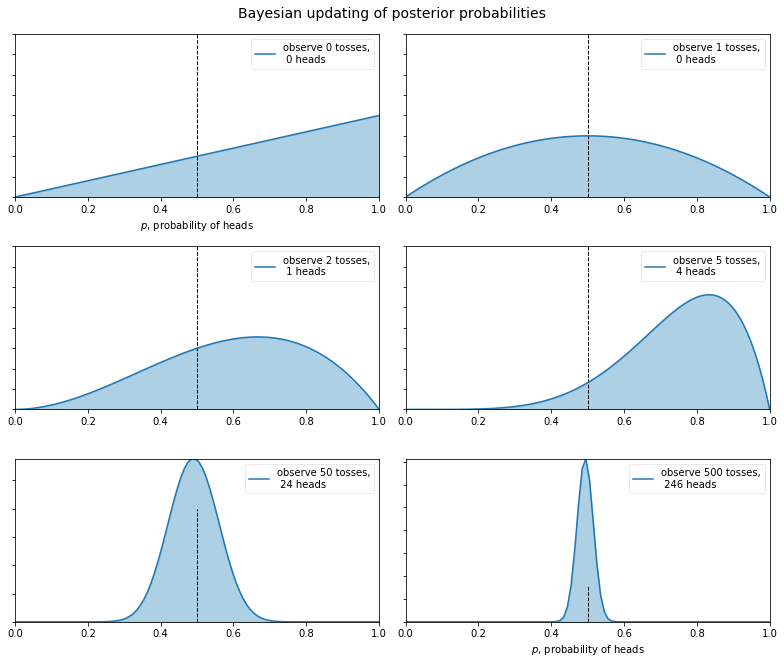
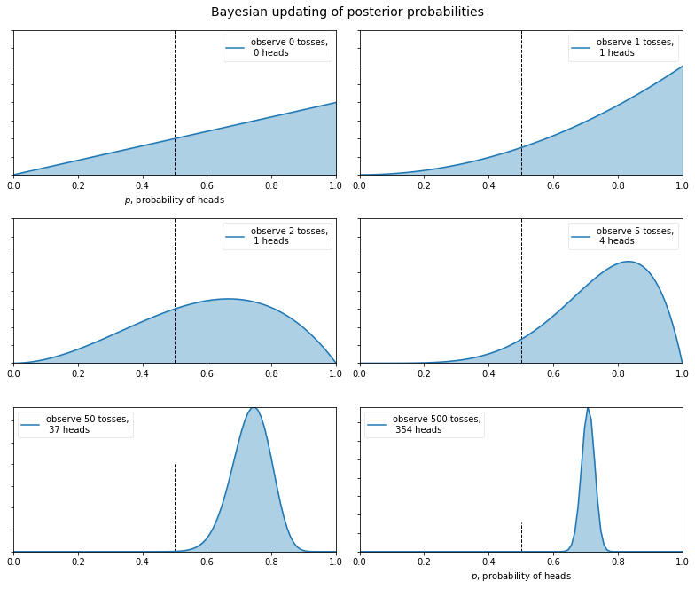
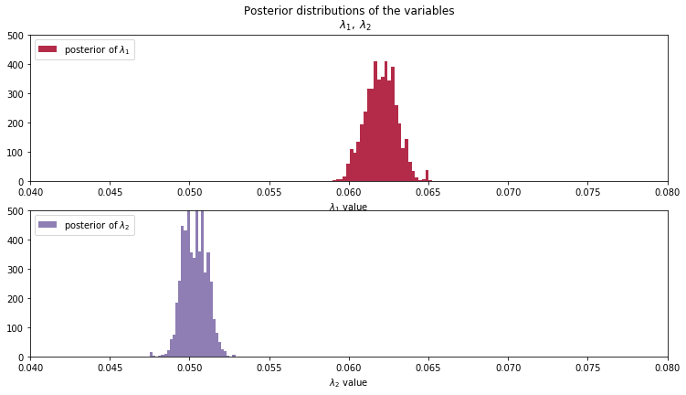
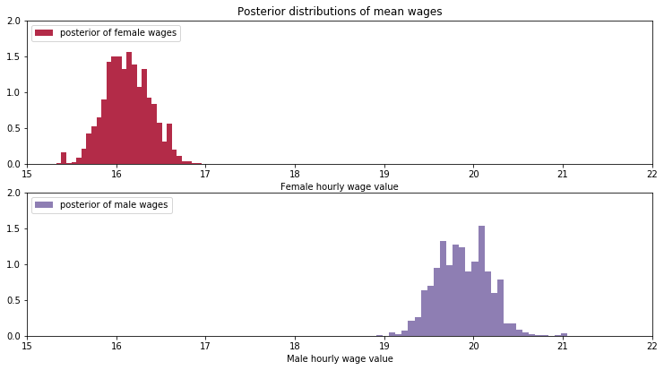

# Bayesian Statistics and Modeling<br>Part I

---

# A new order


---

# A new order

Traditional modeling leaves much to be desired
- Point estimates
- Variance matrices
- Strict assumptions

What if we could build models under more transparent assumptions, according to what we REALLY believe about our data?

---

# Bayes' Theorem

<br>

$$ P(A|X) = \frac{P(X|A)P(A)}{P(X)} $$

For a great introduction to the theorem, check out [this video](https://www.youtube.com/watch?v=HZGCoVF3YvM)

---

# Bayes' Theorem

$$ P(A|X) = \frac{P(X|A)P(A)}{P(X)} $$

- $P(A|X)$ - The probability of observing some event $A$ given the evidence $X$
- $P(X|A)$ - The likelihood of observing $X$ if $A$ is true
- $P(A)$ - The likelihood of $A$ being true
- $P(B)$ - The likelihood of $B$ being true

---

# Bayes' Theorem

$$ P(A|X) = \frac{P(X|A)P(A)}{P(X)} $$

- $P(A|X)$ - The POSTERIOR
- $P(X|A)$ - The LIKELIHOOD
- $P(A)$ - The PRIOR

---

# Bayes' Theorem and Modeling

In words, we want to determine the probability of an event (the POSTERIOR) based on our beliefs (the PRIOR) and empirical evidence (the LIKELIHOOD)

---

# Flipping a coin

My daughter can't stand losing. If anybody was going to find an unfair coin and use it to her advantage, she is the first person I would suspect (maybe second to her brother). 

Nevertheless, I agree to toss a coin with her. A lot of times. 

---

# Let's make a widget:

```python
import scipy.stats as stats
import numpy as np
from ipywidgets import interact, IntSlider

from bokeh.io import push_notebook, show, output_notebook
from bokeh.plotting import figure
output_notebook()

start_x = [x/50 for x in range(50)]
start_y = [stats.beta.pdf(i, 2, 1) for i in start_x]

p = figure(title="Expectations of Coin Flip Odds", height=300, width=600,
           background_fill_color='#efefef')
r = p.line(start_x, start_y,)

# Separate cell
def update(a=1, b=1):
    x = [x/50 for x in range(50)]
    if a==1 and b==1:
        r.data_source.data['y'] = [1 for x in range(50)]
    else:
        r.data_source.data['y'] = [stats.beta.pdf(x/50, a=a, b=b) for x in range(50)]
    push_notebook()

# Separate cell
interact(update, a=(0,10), b=(0,10))
show(p, notebook_handle=True)
```

---



---




---

# What happened?

Despite starting both examples with the same belief (she is likely to be cheating), my conclusion after many coin flips is very different!

- My prior beliefs are OVERCOME BY EVIDENCE

---

# More realistic examples - Gender Wage Gap

Let's take some data about Nebraska, and see if we can't estimate the expected hourly wage for workers, conditional on whether the individual is reported as female.

```py
import pandas as pd

data = pd.read_csv("https://raw.githubusercontent.com/dustywhite7/
Econ8320/master/AssignmentData/assignment8Data.csv")

example_obs = data.loc[data['empstat']==1, ['hrwage', 'female']]
```

---

# `pymc`

In order to conduct Bayesian modeling, we will rely on the `pymc` library, which contains all of the building blocks that we need to make our model.

If we need to install the library:

```py
!pip install pymc
```

Be sure to restart your kernel after installing!

---

# Making a model in `pymc`

As we build a model, we use the `with` keyword to assign variables. Each variable created under the `with` keyword will be associated with the model that we are constructing.

```py
import pymc as pm

with pm.Model() as model:
    # put variables here
```

---

# Making a model in `pymc`

What are we going to model? 
- Need to explicitly define variables of interest, and our PRIOR BELIEFS ABOUT THEM!

We are modeling the mean value of wage. A good starting guess for both males and females is the population mean (for everyone combined).

---

# Making a model in `pymc`

We will model mean wage with the exponential distribution (which allows for any positive value and should thus resemble mean wages). The mean of the exponential distribution is $1/\lambda$

Our PRIOR for the distribution of the mean wage will be an exponential distribution. The $\lambda$ parameter of the male and female distributions, will be $1/\text{population mean}$

---

# Modeling our priors

Let's define our prior belief as `alpha`, and declare our priors:

```py
import pymc as pm

with pm.Model() as model:
    alpha = 1/example_obs['hrwage'].mean()

    lambda_1 = pm.Exponential("lambda_1", alpha) # females
    lambda_2 = pm.Exponential("lambda_2", alpha) # males
```

---

# Modeling our what?

A **prior** describes how we think data are likely to be distributed, based on our current understanding

---

# Some common priors - Exponential Distribution


---

# Some common priors - Normal Distribution


---

# Some common priors - Uniform Distribution


---

# Adding conditional information

Next we need to define how to identify which observations should be associated with each distribution:

```py
with pm.Model() as model:
    alpha = 1/example_obs['hrwage'].mean()

    lambda_1 = pm.Exponential("lambda_1", alpha) # females
    lambda_2 = pm.Exponential("lambda_2", alpha) # males

     # Switch to assign lambda_1 where female==1 otherwise lambda_2
    lambda_ = pm.math.switch(example_obs['female']==1, lambda_1, lambda_2)
```

If `example_obs['female']==1`, then the observation belongs to `lambda_1`. All others belong to `lambda_2`

---

# Combining the data

Finally, we need to define how our data relate to each other:

```py
with pm.Model() as model:
    alpha = 1/example_obs['hrwage'].mean()

    lambda_1 = pm.Exponential("lambda_1", alpha) # females
    lambda_2 = pm.Exponential("lambda_2", alpha) # males

     # Switch to assign lambda_1 where female==1 otherwise lambda_2
    lambda_ = pm.math.switch(example_obs['female']==1, lambda_1, lambda_2)

    observation = pm.Exponential("obs", lambda_, observed=example_obs['hrwage'])
```

Our observations belong to one or other distribution based on the switching algorithm `lambda_`, and the outcome of interest is the column `example_obs['hrwage']`

---

# "Training" by sampling

We will discuss more soon, but at this point, the data are sampled MANY times, and we construct POSTERIOR distributions of our variables of interest (the lambda terms for females and males, respectively).

```py
with model:
    step = pm.Metropolis()
    trace = pm.sample(10000, tune=5000, step=step, return_inferencedata=False)
```

Be warned, this will take a while!

---

# The results

The `trace` object that is created when we sample will contain our sampled outcomes.

```py
lambda_1_samples = trace['lambda_1']
lambda_2_samples = trace['lambda_2']
```

Let's plot the outcomes! (The code is hidden in the slide markdown below)

---

<!-- # Plotting code - Lambda

```py
from IPython.core.pylabtools import figsize
import numpy as np
from matplotlib import pyplot as plt

figsize(12.5, 10)
#histogram of the samples:

ax = plt.subplot(311)
ax.set_autoscaley_on(False)

plt.hist(lambda_1_samples, histtype='stepfilled', bins=30, alpha=0.85,
         label="posterior of $\lambda_1$", color="#A60628", density=True)
plt.legend(loc="upper left")
plt.title(r"""Posterior distributions of the variables
    $\lambda_1,\;\lambda_2$""")
plt.ylim([0, 500])
plt.xlim([0.04, 0.08])
plt.xlabel("$\lambda_1$ value")

ax = plt.subplot(312)
ax.set_autoscaley_on(False)
plt.hist(lambda_2_samples, histtype='stepfilled', bins=30, alpha=0.85,
         label="posterior of $\lambda_2$", color="#7A68A6", density=True)
plt.legend(loc="upper left")
plt.ylim([0, 500])
plt.xlim([0.04, 0.08])
plt.xlabel("$\lambda_2$ value")
```

---

# Plotting code - Mean wages

```py
wage_1_samples = np.array([1/i for i in lambda_1_samples])
wage_2_samples = np.array([1/i for i in lambda_2_samples])

figsize(12.5, 10)
#histogram of the samples:

ax = plt.subplot(311)
ax.set_autoscaley_on(False)

plt.hist(wage_1_samples, histtype='stepfilled', bins=30, alpha=0.85,
         label="posterior of female wages", color="#A60628", density=True)
plt.legend(loc="upper left")
plt.title(r"""Posterior distributions of mean wages""")
plt.ylim([0, 2])
plt.xlim([15, 22])
plt.xlabel("Female hourly wage value")

ax = plt.subplot(312)
ax.set_autoscaley_on(False)
plt.hist(wage_2_samples, histtype='stepfilled', bins=30, alpha=0.85,
         label="posterior of male wages", color="#7A68A6", density=True)
plt.legend(loc="upper left")
plt.ylim([0, 2])
plt.xlim([15, 22])
plt.xlabel("Male hourly wage value")
```

--- -->

# Lambda Posterior



---

# Wage Posterior



---

# What do we learn?

Based on our visuals, we should strongly suspect that typical wages for males and females are different from one another!

```py
print(wage_1_samples.mean(), wage_2_samples.mean())
```

`16.125290853129055 19.87408256112675`

```py
print(wage_1_samples.max(), wage_2_samples.min())
```

`17.015274911773645 18.911871901898618`

Not even the most generous observed draw from the female distribution (~17) overlaps with the lowest observed draw for males (~19)!

---

# Interpretation

This does NOT mean that no women earn as much as a man!

It DOES mean that in no sample we observed does the AVERAGE woman earn as much as the AVERAGE man

**We are describing the distribution of the STATISTIC**

---

# Questions and observations

**Question**: What would happen if we changed our priors?

**Observation**: We should always build priors based on our beliefs about the system we are modeling

**Observation**: The sampled values are NOT the population distribution! They are the sampled values of the **statistic** ($\lambda$, wage, etc.)

---

# Lab time!