# Bayesian Statistics and Modeling Part II

---

# Time series modeling with `pymc3`

###### Based on [this example](https://docs.pymc.io/en/v3/pymc-examples/examples/time_series/Air_passengers-Prophet_with_Bayesian_workflow.html)

---

# Prior predictions (WHAT??)

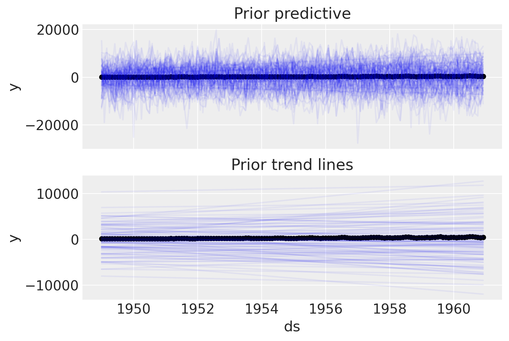

---

# Prior predictions (WHAT??)

- Look at a large array of possible "reasonable" outcomes given our assumptions about the data
- Gives us an idea of whether our priors make sense
- In this case, we want to make some corrections

---

# Updated priors

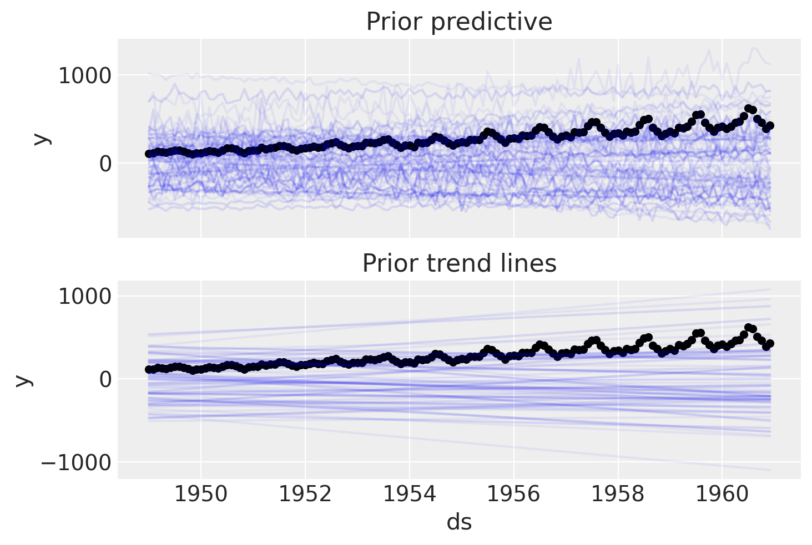

---

# Posterior predictions

- Incorporate our actual data and then compare our model to observed outcomes
- Decide if we think that our model can make reasonable predictions

---

# Posterior predictions

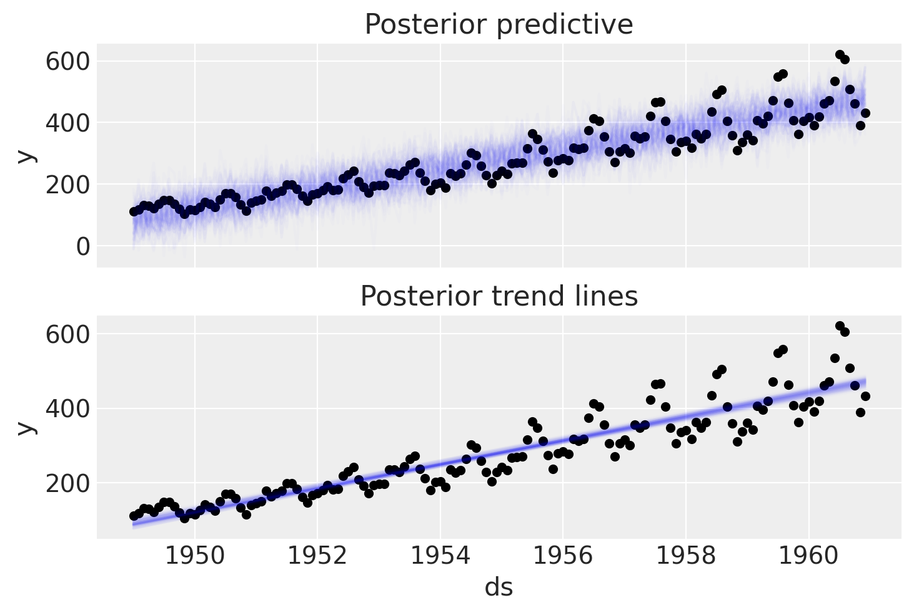

---

# Adding seasonality

We add a group of periodic functions (fourier features) to function as our "seasonality splines" (if we think of our model as a GAM). They will get stretched or weighted based on observations.

---

# Seasonal priors

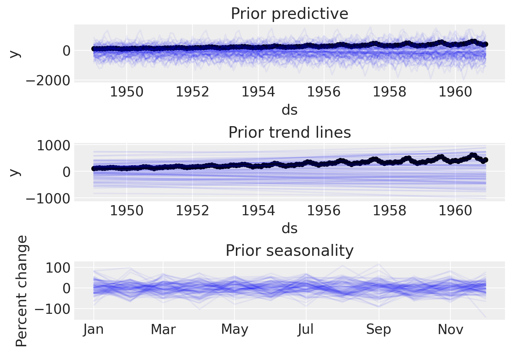

---

# Seasonal posteriors

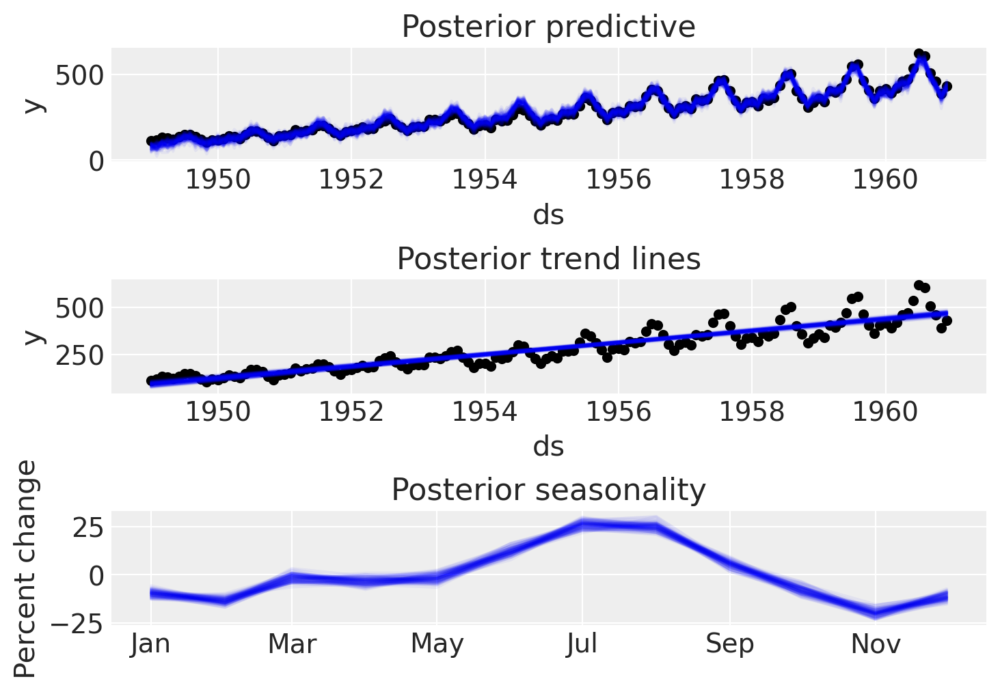

---

# Modeling baseball outcomes

###### A revised/updated version of [this tutorial](https://docs.pymc.io/en/v3/pymc-examples/examples/case_studies/hierarchical_partial_pooling.html)

---

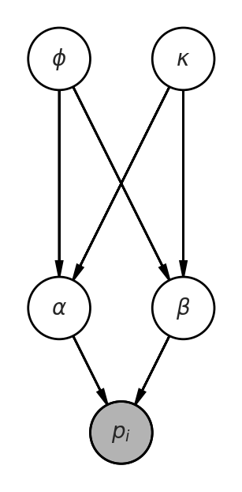

- $\phi$ (phi) - Our population-level expectation of batting average
- $\kappa$ (kappa) - Population variance in batting average
- $\alpha, \beta$ - Parameters of our beta distribution
- $p_i$ - Individual batting average

---

$$ \alpha = \phi \cdot \kappa $$

$$ \beta = (1-\phi) \cdot \kappa $$

---

# Beta distribution

- Used where there are binary outcomes (hit or no hit)

- Tilts toward 1 or 0 based on observed outcomes and concentration of those outcomes

---

# Population values

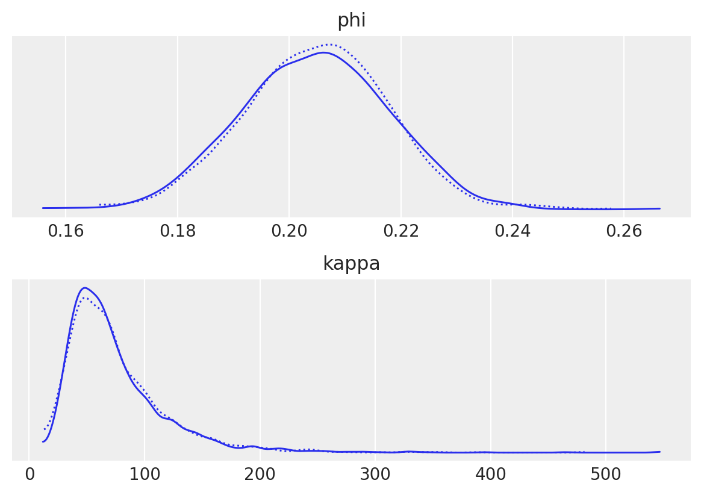

---

# Player with 4 at-bats, no hits

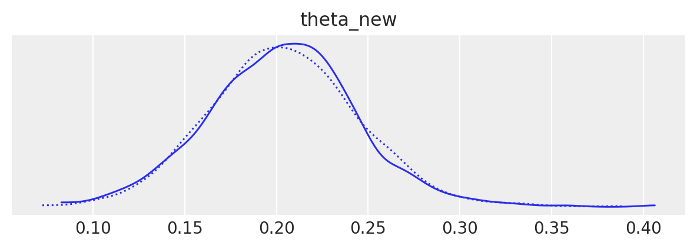

---

# Player with 25 at-bats, no hits

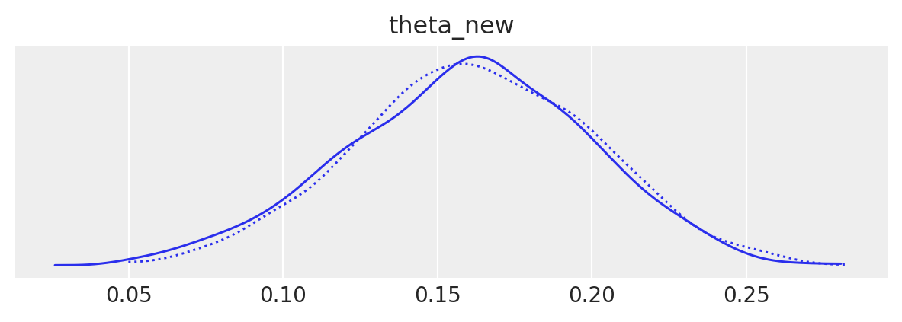

---

# Player with 50 at-bats, no hits

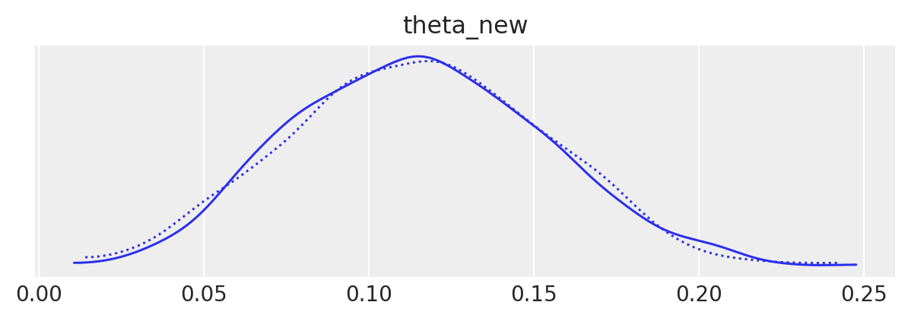

---

# Mariners 2021

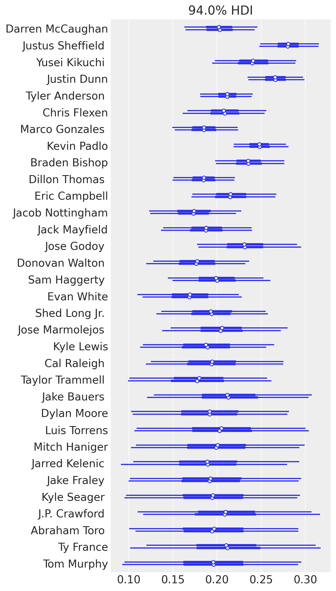