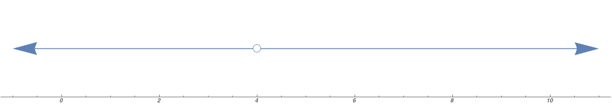
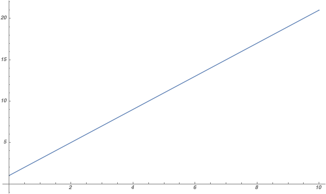
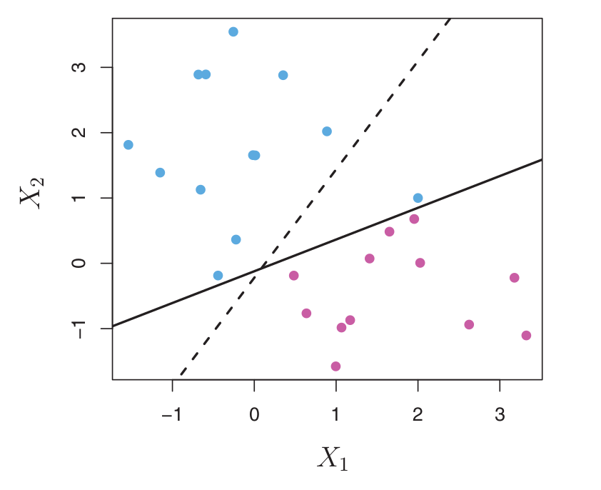
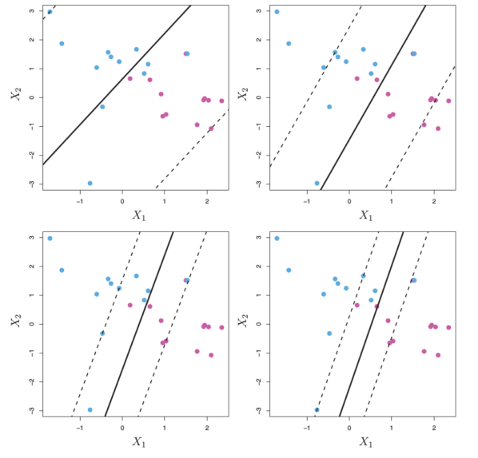
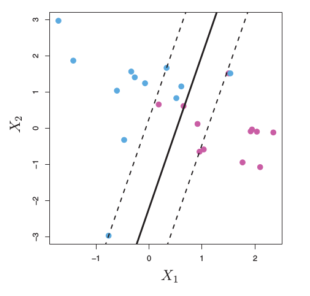

# Day 13: Support Vector Machines

---

### First, Hyperplanes

With your group, take 3 minutes or so to answer the following questions:

1. How do you divide a 1-Dimensional space into two?
2. How do you divide a 2-Dimensional space into two?
3. How do you divide a 3-Dimensional space into two?

---

### Hyperplanes

**Hyperplanes** sound fancy, but they are just generalizations of concepts that you are already familiar with. 

When we divide a 1-Dimensional space into two, we just need to choose a **point** (a 0-Dimensional object) at which we can divide our line (a 1-Dimensional object).





---

### Hyperplanes

We divide a 2-Dimensional space using a **line** (1-D) 





---

### Hyperplanes
We use a **plane** (2-D) to divide our 3-D space:


---

### Hyperplanes

<br>

A **hyperplane** is an $(n-1)$-dimensional object in $n$-dimensional space. It can be used to divide the space into two distinct segments defined by their position relative to the hyperplane.

A hyperplane can be defined by a vector of length $(n-1)$, describing the slope of the hyperplane in each dimension.

---

### Linear Regression and Hyperplanes

When we fit a linear model, we solve the following problem:

$$ \min_{\alpha, \beta}\; \sum_{i=1}^N (y_i - x_i \beta)^2 $$

This problem is really just a statement of **finding the hyperplane that minimizes the squared error of prediction for all observations**


---

### Support Vector Machines

SVMs are essentially the **opposite** of linear regression. 
- **Linear regression**: find a hyperplane that best **adheres to** our observations as a predictor
- **SVM**: create a hyperplane that is **as far as possible** from our observations while placing observations of each class on opposite sides of the hyperplane

---

### Support Vector Machines


With two different classes, we want to separate as well as possible based on our inputs ($X_1$ and $X_2$ above)

---

### Separating Hyperplanes?

If we create a strict classifier (assuming that it is possible to do so), we must find a hyperplane that **perfectly** separates our classes.
- May not be possible
- May not be desirable, even if possible
	- Would almost certainly lead to overfitting

Instead, we can use a different fitting rule to determine our ideal separator.

---



---

### SVM Problem in Math Form

$$ \max_{\beta_0, ..., \beta_p, \epsilon_1, ..., \epsilon_n} M  $$

$$ \text{subject to}\;\; \sum_{j=1}^p \beta_j^2 = 1, $$

$$ y_i(\beta_0 + \beta_1 x_{i1} + ... + \beta_p x_{ip}) \geq M(1-\epsilon_i),$$

$$ \epsilon_i \geq 0, \;\;\;\;\;\sum_{i=1}^n\epsilon_i\leq C $$

---





---

### SVM Problem in Visual Form



- Only points within the buffer affect the SVM $(\epsilon > 0)$
- $C$ dictates how tolerant we are of error

---

### SVM and Nonlinearities


Well that doesn't look good...
- How do we solve nonlinear functional forms in an SVM setting?

---

### SVM and Nonlinearities

We can get creative to solve this problem!
- How do we include non-linear parameters in linear regression?
	- We treat the non-linear parameter as a variable with a linear effect

$$ \hat{y}_i = \alpha + \beta_1 \cdot age_i + \beta_2 \cdot age_i^2 $$

This same concept can be applied to an SVM in order to classify functions that are not linear.


---

### Implementing an SVM

```python
# Import libraries, including the SVC classifier
import pandas as pd
import numpy as np
import patsy as pt
from sklearn.svm import SVC
from sklearn.model_selection import train_test_split
from sklearn.metrics import accuracy_score
# Import student grade data
data = pd.read_csv("passFailTrain.csv")
```

We are using the SVC, or [Support Vector Classifier](http://scikit-learn.org/stable/modules/generated/sklearn.svm.SVC.html), algorithm in order to make our predictions.

---

### Implementing an SVM

```python
# Generate our x and y data
y, x = pt.dmatrices("G3 ~ -1 + sex +\
	age + C(address) + C(famsize) +\
        C(Pstatus) + studytime + failures +\
        schoolsup + paid + freetime + absences +\
        health + C(Mjob) + C(Fjob) + C(Medu) +\
        C(Fedu) + G1 + G2", data=data)
y = np.ravel(y) # Reduce y to a 1-D array
```

We need to use the ```C()``` command to create categorical bins from our data where numerical values are used to store categorical data. This data is not naturally ordinal, and would be treated as ordinal if we did not transform it.

---

### Implementing an SVM

```python
# Create training and testing data
x, xt, y, yt = train_test_split(x, y, 
	test_size = 0.1, random_state=42)

# Generate a model with a C value of 10. Remember that 
#    C is our error penalty term.
model = SVC(C=10, kernel='rbf') # Linear, rbf, polynomial
                                # and sigmoid kernels
reg = model.fit(x, y) # Fit the model
pred = reg.predict(xt) # Make predictions with test data

print("\nModel accuracy is %s\n" % 
	str(round(accuracy_score(pred, np.ravel(yt)), 3)))
```

```Model accuracy is .800```

---

### Changing our penalty

```python
# ****
model = SVC(C=1, kernel='rbf') # Modified Penalty Term
# ****
reg = model.fit(x, y) # Fit the model
pred = reg.predict(xt) # Make predictions with test data

print("\nModel accuracy is %s\n" % 
	str(round(accuracy_score(pred, np.ravel(yt)), 3)))
```

```Model accuracy is .870```

In this case, by increasing the cost of errors, we can improve our model. In other problems, the reverse may be true.

---

### For Lab Today

Work to improve your ability to predict overall beer ratings. Be sure to take some time and use different kernel functions, and to try different tuning parameters.

Additionally, compare your ability to predict the class of the data using SVMs to other algorithms, such as Decision Trees, Random Forests, etc.
