# Bayesian Statistics and Modeling Part III

---

# Bayesian linear models

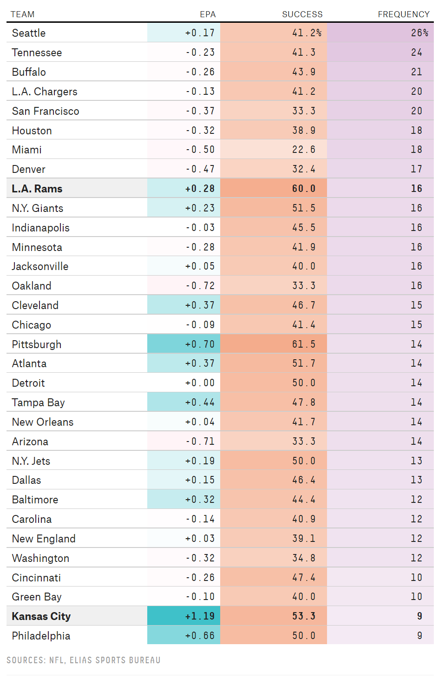

I love (for better or worse) rooting for the Seahawks. In many recent years, they have insisted on running a LOT more than most teams.

(Plot is frequency of Run-Run-Pass sequences by team)

---

# Bayesian Linear Models

Can we determine the likelihood of a play being successful based on various characteristics of that play?

- Are runs more successful than passes? (unlikely, but Pete Carroll thinks so)
- We should probably also account for down and distance

---

# What's the model?

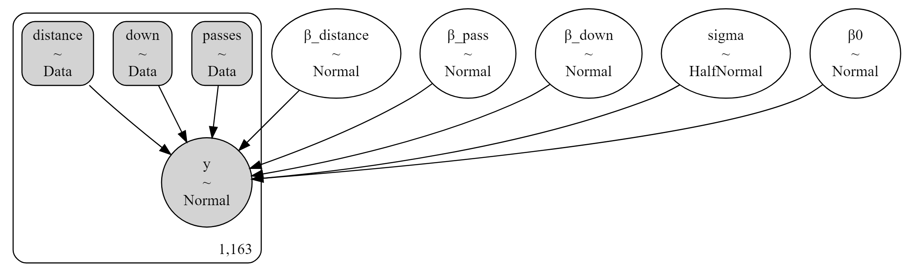

---

# What's the model?

Let's go look at our code now, and generate a regression model using the Bayesian method

---

# Complete Regression Results

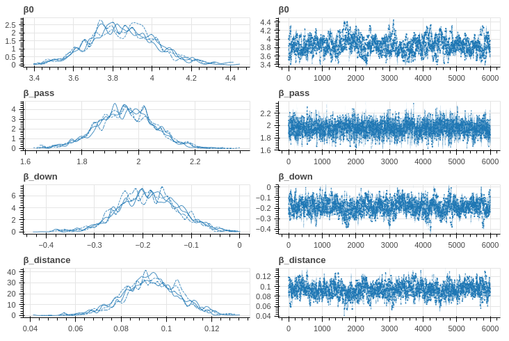

---

# Making sense of choices

What if we want to be able to look at specific contexts?

We write quick function and are off to the races!

---

# 1st and 10...

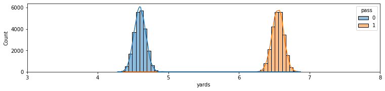

---

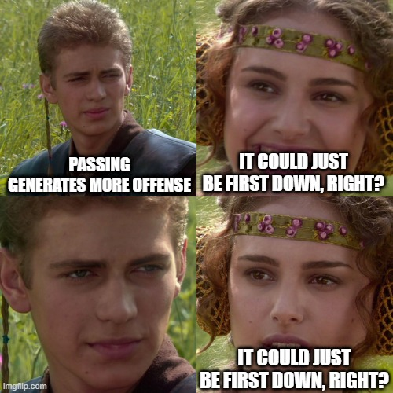

---

# 2nd and 10...

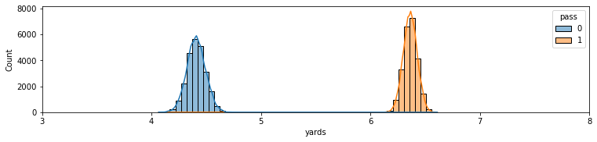

---

# 3rd and 10...

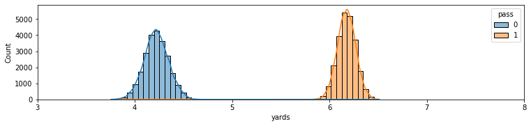

---

# 4th and 10!!

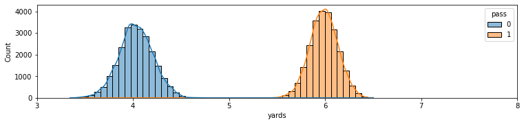

---

# Ok, but maybe the Seahawks are different!

Are they? Let's estimate our model with only Seahawks data

---

# Complete Regression Results

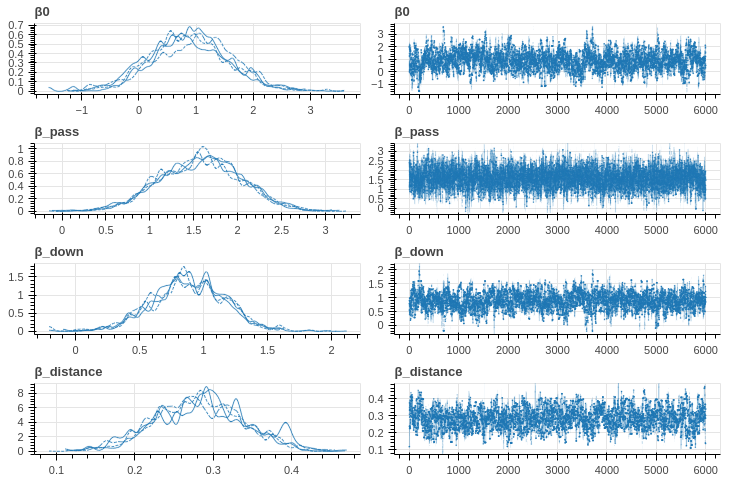

---

# Making sense of choices

What if we want to be able to look at specific contexts?

We write quick function and are off to the races!

---

# 1st and 10...

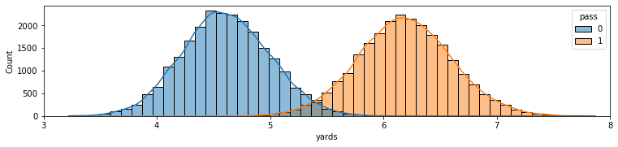

---

# 2nd and 10...

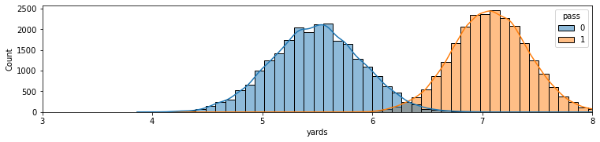

---

# 3rd and 10...

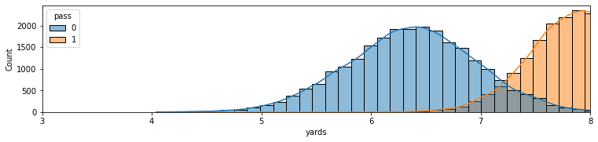

---

# 4th and 10!!

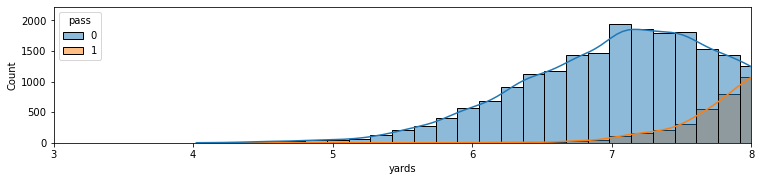

---

# How does it work?

1. Our model creates a `trace` object
2. Each trace contains however many samples (in this case ~40k) of the estimated parameter
3. We use these to look at the **distribution of parameter values**

---

# Credible intervals

Rather than having Confidence Intervals, we have Credible Intervals in Bayesian statistics.
- 95% of sampled parameter values fall inside a 95% CI
- We can shape them arbitrarily
- We can also just use them to measure the likelihood that one measure exceeds another!
    - For example, our distributions for the seahawks overlap, but that doesn't mean running is EVER better!

---

# More flexibility

We have only scratched the surface, but we are starting to see how we can create flexible models that allow us to ask much more **real** questions than we might with a null-hypothesis framework

---

# Lab Time!