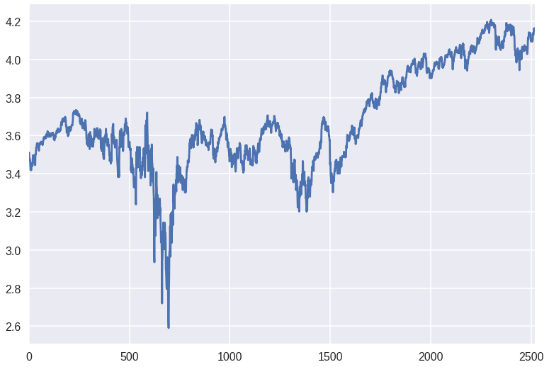
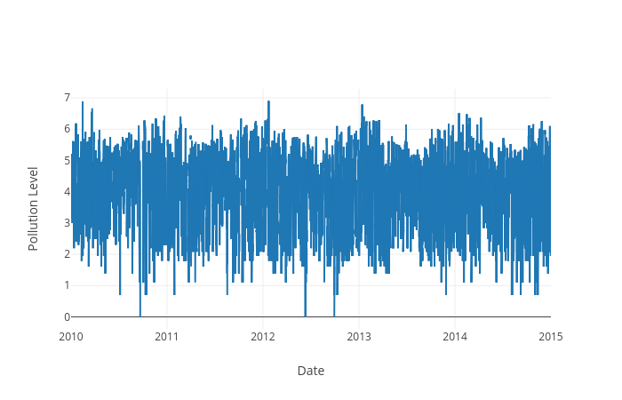
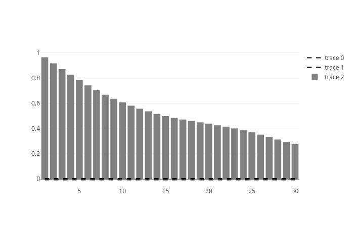
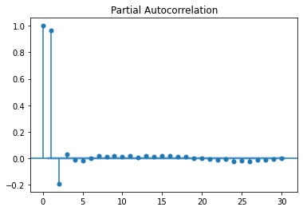
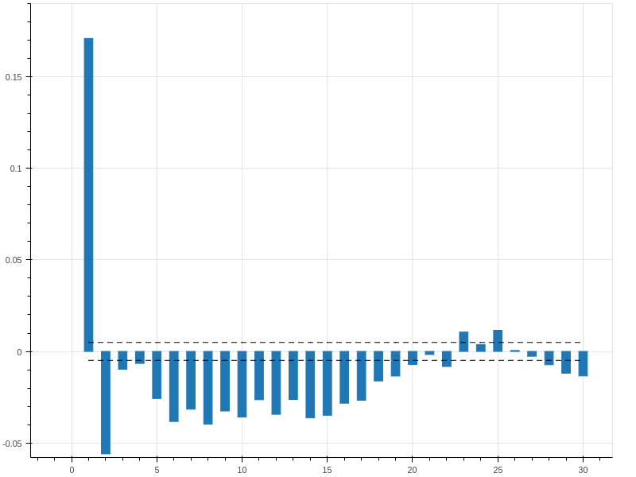
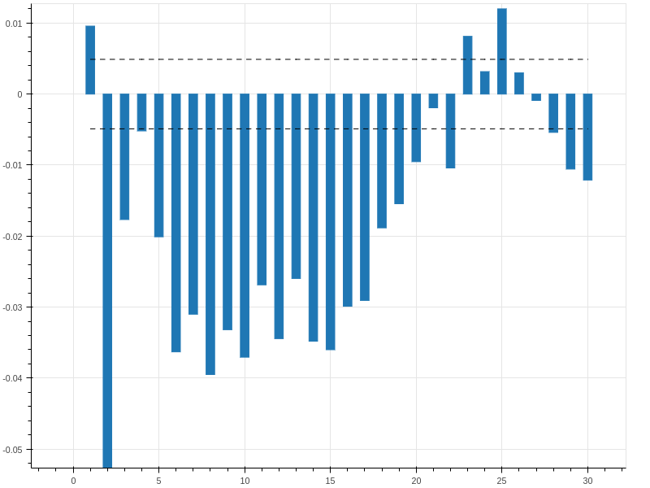
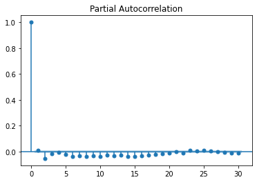
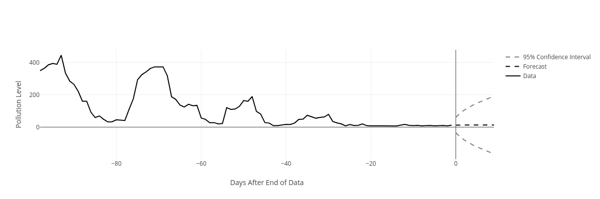

<!--
$theme: gaia
template: invert
-->


# Lectures 2 & 3: Time Series, ARIMA Models <br><font size="3">This lesson is based on material by [Robert Nau, Duke University](http://people.duke.edu/~rnau/forecasting.htm)</font>

---

### Using Statsmodels to implement OLS

<br>

```python
import statsmodels.api as sm
import patsy as pt

data = pd.read_csv("pollutionBeijing.csv")
y, x = pt.dmatrices("myDepVar ~ myIndepVar", data=data)
model = sm.ols(exog=x, endog=y)
reg = model.fit() # Fit the model using standard params
```

---

### Time Series Data

<br>

A time series consists of repeated observations of a single variable, $y$, at various times, $t$.

$$\mathbf{y}=\{y_1, y_2, y_3, ..., y_t\}  $$

We seek to predict $y_{t+1}$ using the information from previous observations **y**.


---

### Time Series Data

In order to estimate $y_{t+1}$, we need to find the effect of previous observations of $y$ on the upcoming period. We might write this model as

<br>

$$ y_{t+1}=\alpha + \sum_{s=1}^t\beta_s\cdot y_s + \epsilon $$

---

### Time Series Data

If we choose to base our model solely on the previous period, then the model would be written

<br>

$$ y_{t+1}=\alpha + \beta_t \cdot y_t + \epsilon $$

<br>

Critically, OLS estimates of this model are invalid.

---

### Autocorrelation

One of the primary assumptions of the OLS model is that

$$Cov(\epsilon_t,\epsilon_s) = 0, \;\forall\; t \neq s $$

This assumption is clearly **not** valid in the case of time series data.

Let's look at some data to find out why.

---

### Autocorrelation



---

### Autocorrelation

<center>
</img>
</center>

We need to find a model that can eliminate the autocorrelation almost always seen in time series data.

---

### Autoregressive Models

AR models are based on the premise that  deviation from the underlying trend in the data persists in all future observations.


$$ y_{t} = \alpha + \sum_{i=1}^p \rho_i\cdot y_{t-i} + \epsilon_t $$


Where $\rho$ is the correlation term between periods and $\epsilon$ is an error (shock) term

---

### AR Models

- We need to consider lagged observations of $y$ in order to predict future outcomes
- The number of lags that we include is the **order** of our AR model
	- The model is an AR(p) Model, where p is the order of the model

---

### AR Models

- The AR coefficients tell us how quickly a model returns to its mean
	- If the coefficients on AR variables add up to close to 1, then the model reverts to its mean **slowly**
	- If the coefficients sum to near zero, then the model reverts to its mean **quickly**


---

### Integrated Models

Integration occurs when a process is non-stationary. A non-stationary process is one that contains a linear time trend. One example might be a long-term series of stock prices:

<center>
</img>
</center>

---

### Integrated Models

We need to ensure that our data is stationary. To do so, we need to remove the time-trend from the data.
- This is typically done through differencing

$$ y^s_i = y_i - y_{i-1} $$

where $y^s_t$ is the stationary time series based on the original series $y_t$


---

### Integrated Models

Here,  the time trend has been differenced out of the data from the previous plot

<center>


</center>

---

### Integrated Models

The Integration term $d$ represents the number of differencing operations performed on the data:
- I(1): $y^s_t = y_t - y_{t-1}$
- I(2): $y^s_t = (y_t - y_{t-1}) - (y_{t-1} - y_{t-2})$

Where an I(2) model is analogous to a standard difference-in-differences model applied to time-series data.

---

### Moving Average Models

While an AR($\cdot$) model accounts for previous values of the dependent variable, MA($\cdot$) models account for previous values of the **error** terms:

$$ AR(p) = \alpha + \sum_{i=1}^p \rho_i\cdot y_{t-i} + \epsilon_t $$
$$ MA(q) = \alpha + \sum_{i=1}^q \theta_i\cdot \epsilon_{t-i} + \epsilon_t $$

---

### Moving Average Models

An MA model suggests that the current value of a time-series depends linearly on previous error terms.
- Current value depends on how far away from the underlying trend previous periods fell
- The larger $\theta$ becomes, the more persistent those error terms are

---

### Moving Average Models

- AR models' effects last infinitely far into the future
	- Each observation is dependent on the observation before
- In an MA model, the effect of previous periods only persist for $q$ periods 
	- Each error is uncorrelated with previous errors


---

### Putting it Together

In order to account for all the problems that we might encounter in time series data, we can make use of ARIMA models.

**A**uto**R**egressive **I**ntegrated **M**oving **A**verage models allow us to
- Include lags of the dependent variable
- Take differences to eliminate trends
- Include lagged error terms


---

### The ARIMA Model

ARIMA models are often referred to as 
ARIMA($p,d,q$) models, where $p$, $d$, and $q$ are the parameters denoting the order of the autoregressive terms, integration terms, and moving average terms, respectively.
- It is often a matter of guessing and checking to find the correct specification for a model

---

### ARIMA in Python

```python
# Import needed libraries
import pandas as pd
import numpy as np
import statsmodels.api as sm
import statsmodels.tsa.stattools as st
from plotly.offline import plot
import plotly.graph_objs as go

# Read data, then set the index to be the date
data = pd.read_csv("pollutionBeijing.csv")

data['datetime'] = pd.to_datetime(data['datetime'], 
	format='%Y-%m-%d %H:%M:%S')
data.set_index(pd.DatetimeIndex(data['datetime']), 
	inplace=True)
```
---

### ARIMA in Python
```python
# Plot the data
trace = go.Scatter(
    x = data['datetime'],
    y = np.log(data['pm2.5']),
    mode = 'lines',
    )

pdata = go.Data([trace])

layout = go.Layout(
    title=None,
    xaxis = dict(title = 'Date', type='date'),
    yaxis = dict(title = 'Pollution Level')
    )

plot(go.Figure(data=pdata, layout=layout))
```

---

### ARIMA in Python

<br>
<center>


</center>

---

#### ARIMA in Python
```python
# Plot the DIFFERENCED data
trace = go.Scatter(
    x = data['datetime'][1:],
    y = np.diff(np.log(data['pm2.5']))[1:],
    mode = 'lines',
    )

pdata = go.Data([trace])

layout = go.Layout(
    title=None,
    xaxis = dict(title = 'Date', type='date'),
    yaxis = dict(title = 'Pollution Level')
    )

plot(go.Figure(data=pdata, layout=layout))
```

---

#### ARIMA in Python

<br>
<center>


</center>

---

### Testing for Stationarity

We can use the **Augmented Dickey-Fuller Test** to determine whether or not our data is stationary.

- H$_0$: A unit root is present in our data
- H$_A$: The data is stationary

This can help us to determine whether or not differencing our data is required or sufficient for inducing stationarity.

---

#### Testing for Stationarity

We can use the **Augmented Dickey-Fuller Test** to determine whether or not our data is stationary.

```python
>>> st.adfuller(
>>> 	data['pm2.5'][-250:], maxlag=12)

(-3.1576359480752445, # The test statistic
 0.022571607041567278, # The p-value
 2, # Number of AR lags in model
 247, # Number of obvservations
 {'1%': -3.4571053097263209, 
  '10%': -2.5730443824681606, # The 1%, 5%, and 10%
  '5%': -2.873313676101283},  # thresholds
 2272.5419900847974) # The model information criterion
```

In this case, we can reject the unit-root hypothesis!

---

### Fitting the ARIMA model

```python
import statsmodels.api as sm

model = sm.tsa.ARIMA(np.log(data["pm2.5"]), (1,1,0)) 
		  # specifying an ARIMA(1,1,0) model
reg = model.fit() # Fit the model using standard params
res = reg.resid   # store the residuals as res
```

Once we fit the ARIMA model using our selected specification, we can then explore the goodness of fit of the model using our model residuals (forecast errors). We will focus on this next week.

---

### For lab today:

Working with your group, use the Omaha historic weather data (using all but the final 10 days) to:
- Choose a time series
- Plot the data
- Make the data stationary (unless you believe it is already stationary)
- Fit an ARIMA model
- Find a model that you believe describes your weather pattern of choice as well as possible.


---

### Diagnostics through Plotting, ARIMAX Models

---


### Finding the Right Fit
<br>

- Time series models are unique in Econometrics: we need to **visually** diagnose the proper specifications for our model
	- This takes practice
	- This takes repetition and iteration for any given model


---

### The Autocorrelation Function (ACF)

The ACF illustrates the correlation between a dependent variable and its lags.
- Choose how many lags to explore (based on nature of data)
- **Reminder**: correlations will vary between -1 and 1, with 1 being perfect correlation, and -1 being perfect inverse correlation
- Correlation can be cyclical!

---

### The Autocorrelation Function (ACF)

<br>
<center>



</center>

---

### The Partial Autocorrelation Function

The PACF illustrates the correlation between a dependent variable and its lags, **after controlling for lower-order lags**.
- Choose how many lags to explore (based on nature of data)

---

### The Partial Autocorrelation Function (PACF)

<center>



</center>

---

### Building the Model

1. Make the series **stationary**
	- When the ACF falls "quickly" to zero at higher lags, the series is stationary
	- Can also use a **unit root test** to check for stationarity


---

### Building the Model

1. Make the series **stationary**
2. Use ACF and PACF plots to decide if you should include **AR** or **MA** terms in your model
	- Remember that we typically do not use both in the same model


---

### Building the Model

Signatures of **AR** and **MA** models:

<br>

**AR** Model: ACF dies out gradually, and the PACF cuts off sharply after a few lags

**MA** Model: ACF cuts off sharply, and PACF dies off more gradually (remember that **MA** models are based on previous *errors*)


---

### Building the Model

1. Make the series **stationary**
2. Use ACF and PACF plots to decide if you should include **AR** or **MA** terms in your model
3. Fit the model, and check residual ACF and PACF for lingering significance
4. If there are significant terms in residual ACF or PACF, add **AR** or **MA** terms, and try again


---


### ARIMA Diagnostics in Python

```python
# Generate plot from ACF
acf, aint=st.acf(data['pm2.5'], nlags=30, alpha=.05)

trace = go.Scatter(
    x = list(range(1,31)),
    y = [1/np.sqrt(len(data))]*30,
    line = dict(dash='dash', color='black'))
trace1 = go.Scatter(
    x = list(range(1,31)),
    y = [-1/np.sqrt(len(data))]*30,
    line = dict(dash='dash', color='black'))
trace2 = go.Bar(
    x = list(range(1,31)),
    y = acf[1:],
    marker = dict(color='grey'))

pdata = go.Data([trace, trace1, trace2])
plot(go.Figure(data=pdata))
```

---

### ACF Plot

<center>

</center>
This is a clear indication that we do NOT have stationary data (yet)

---

### PACF Plot
<center>

</center>

---


### Differenced ACF Plot



Differencing our data reduces the amount of structure that remains in the ACF.


---

### Time to Model!

Once we have 
- Reduced our ACF and PACF plots to looking like noise
- Discovered the amount of differencing required by our data (to make our data stationary)

It is time to fit our model using the ```arima``` command we learned last week. 

We can then validate our model by examining the residual ACF and PACF plots.

---


### Fitting the ARIMA model

Residual ACF 

<center>

</center>

---

### Fitting the ARIMA model

Residual PACF - nearly identical to the ACF plot (and is very small, cyclical)

<center>

</center>


---

### Looking Ahead

Now that we have a fitted model, we can start to make predictions

```python
fcst = reg.forecast(steps=10) # Generate forecast
upper = fcst[2][:,1] # Specify upper 95% CI
lower = fcst[2][:,0] # Specify lower 95% CI
```

We make our out-of-sample forecast, and store it as three arrays: the forecast, the upper bound of the 95% Confidence Interval, and the lower bound of the 95% Confidence Interval

---

### Looking Ahead

```python
#Plotting a forecast
trace = go.Scatter(
    x = list(range(0,10)),
    y = upper,
    mode = 'lines',
    line = dict(dash='dash', color='grey'),
    name = '95% Confidence Interval')

trace1 = go.Scatter(
    x = list(range(0,10)),
    y = lower,
    mode = 'lines',
    line = dict(dash='dash', color='grey'),
    name = '95% Confidence Interval',
    showlegend = False)
```

---

### Looking Ahead

```python
trace2 = go.Scatter(
    x = list(range(0,10)),
    y = fcst[0],
    mode = 'lines',
    line = dict(dash='dash', color='black'),
    name = 'Forecast')

trace3 = go.Scatter(
    x = list(range(-98,0)),
    y = data['pm2.5'][-98:],
    line = dict(color='black'),
    name = 'Data'
    )
```

---

### Looking Ahead

```python
pdata = go.Data([trace, trace1, trace2, trace3])

layout = go.Layout(
    xaxis=dict(title="Days After End of Data"),
    yaxis=dict(title="Pollution Level"),
    width=1200,
    height=400
    )

plot(go.Figure(data=pdata, layout=layout))
```

We can then take a look at how our prediction follows the pattern from our time series

---

### Looking Ahead

Plotting the forecast,




---


### ARIMA + X

<br><br>

We can improve on the ARIMA model in many cases if we use ARIMA**X** (ARIMA with e**X**ogenous variables) models to include exogenous regressors in our estimations!

---

### ARIMAX

Let's use the data from last week's lab to get started:

```python
import pandas as pd
import numpy as np
import patsy as pt
import statsmodels.api as sm
import statsmodels.tsa.stattools as st
from plotly.offline import plot
import plotly.graph_objs as go

data = pd.read_csv("omahaNOAA.csv")[-(365*24):]
		# We are keeping only the last 365 days
```

---

### ARIMAX

```python
trace = go.Scatter(
    x = data.DATE,
    y = data.HOURLYDRYBULBTEMPF,
    line = dict(color='black'),
    name = 'Data')
pdata = go.Data([trace])
layout = go.Layout(
    xaxis=dict(title="Date/Time", type='date'),
    yaxis=dict(title="Temperature (F)"),
    width=1200,
    height=400)
plot(go.Figure(data=pdata, layout=layout))
```

We have a lot of erroneous entries!

```python
data = data[data.HOURLYDRYBULBTEMPF!=0]
```

---

### ARIMAX


```python
# First, let's difference our data TWICE
data['HOURLYDRYBULBTEMPF'] = 
	data['HOURLYDRYBULBTEMPF'].diff(periods=1)
data['HOURLYDRYBULBTEMPF'] = 
	data['HOURLYDRYBULBTEMPF'].diff(periods=24)

eqn = "HOURLYDRYBULBTEMPF ~ HOURLYWindSpeed + " + 
"HOURLYStationPressure + HOURLYPrecip"
        
y, x = pt.dmatrices(eqn, data = data)

# The exog argument permits us to include exogenous vars
model = sm.tsa.ARIMA(y, order=(1,1,0), exog=x)
reg = model.fit(trend='nc', method='mle', 
		maxiter=500, solver='nm')
reg.summary()
```

---

### ARIMAX

When we read our summary, we see the following:

```
==========================================
       Real   Imaginary  Modulus Frequency
------------------------------------------
AR.1  -2.1286 +0.0000j   2.1286   0.5000
------------------------------------------
```

If there is a **Real** value of close to 1 (or lower than 1), this  indicates that our regression model contains a **unit-root**, and our model may not be stationary. In this case, we should run an Augmented Dickey-Fuller test.

---

### SARIMAX

Where can we go when we have cyclical data?
- We can introduce seasonality into our model

The Seasonal Autoregressive Integrated Moving Average Model with Exogenous Regressors (SARIMAX) is designed to deal with this kind of problem.


---

### SARIMAX

We know that temperatures fluctuate daily (even though we have attempted to difference this out)

```python
model = sm.tsa.SARIMAX(y, order=(1,2,0),
		seasonal_order=(1,0,0,24), exog=x)
reg = model.fit(trend='nc', maxiter=500, solver='nm')
reg.summary()
```

Here, we need to include terms for our **seasonal** AR, I, and MA terms, as well as the periodicity of our data (24 observations per day).

---

### Forecasting ARIMAX/SARIMAX

When we forecast based on models with exogenous variables, we need to include those variables as an argument to the forecast method.

```python
# Generating our Forecast
fcst = reg.forecast(steps=10, exog=x[-10:]) 
		     # Generate forecast
upper = fcst[2][:,1] # Specify upper 95% CI
lower = fcst[2][:,0] # Specify lower 95% CI
```

---

### Review

- We can use diagnostic plots to determine the order of our model, and to determine the processes involved (AR vs MA, etc.)
- ARIMAX allows for the use of exogenous variables to help explain our model
- SARIMAX adds seasonality to the model, allowing us to better account for cyclicality in our data.

---

### For Lab Today
Working with your group, use the Omaha historic weather data again to:
- Visually diagnose the order of your chosen time series
- Determine the ideal model parameters
- Decide between an ARIMA, ARIMAX, and SARIMA(X), and provide reasons for your choice based on the work done above