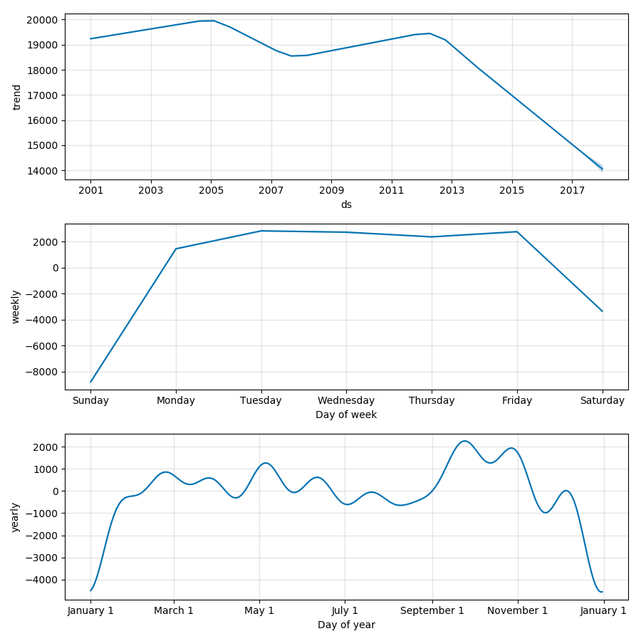

<!--
$theme: gaia
template: invert
-->

# Day 5: Generalized Additive Models

---

# Linear and Nonlinear Models

**Linear Models (ARIMA and VAR)**
- Make strong assumptions about the relationships between dependent and independent variables
- But they are easily interpretable

**Non-linear Models**
- Reduce (or eliminate) these assumptions
- But this is often done at the cost of interpretability

---

### Non-linear Modeling

Non-linear models can be written generally as

$$ y = g(x) + \epsilon $$

where $g(\cdot)$ can be **any** function.

- Tremendous flexibility
- Low likelihood of interpretability


---

### Non-linear Modeling

If $g(\cdot)$ is a function of more than one parameter, interpretation may quickly become difficult.

$$ y = x_1^2x_2^2 + \epsilon $$

In this case, the marginal effect of $x_1$ on $y$ is

$$ \frac{\partial y}{\partial x_1} = 2x_1x_2^2 $$

and depends on the values of both $x_1$ and $x_2$.


---

### Generalized Additive Models

GAMs allow us much of the flexibility of non-linear models, without the difficulty of interpretation.
- Each parameter's effect on the dependent variable is modeled as its own function
- Since the model is additive, interpretation is straightforward, and parameter effects can be isolated

---

### Generalized Additive Models

GAMs allow us much of the flexibility of non-linear models, without the difficulty of interpretation.

$$ y = \sum_{i=1}^N f_i(x_i) + \epsilon $$

For two parameters, this could be expressed as

$$ y = f_1(x_1) + f_2(x_2) +  \epsilon $$

---

### Non-linearity and Smoothness

<center>
</img>
</center>

---

### Non-linearity and Smoothness

On the previous slide, a high-order polynomial was fitted to a parameter.
- Was the fit perfect? **Yes**
- Was it likely to fit the true data-generating process? **No**

---

### Non-linearity and Smoothness

<center>
</img>
</center>

---

### Non-linearity and Smoothness

This time, our high-order polynomial actually seems to represent the true relationship between the input and the output.
- Take care not to overfit your model
- Our true test will be when we fit a model, and use it to make predictions out-of-sample
- In sample, we can never do worse by applying a more complex functional form
- Out of sample, excess complexity can ruin our predictions

---

### GAM Fitting Procedure

If we want to fit an additive model, we need to create a loss function that we can optimize. For one parameter, we need to optimize

$$ y = a + f(x) + \epsilon $$

Sum of squared errors for this function is

$$ SSE = \sum_{i=1}^n (y_i - a - f(x_i))^2 $$


---

### Choosing GAM Smoothness

In addition to minimizing the SSE term, we need to include a term that will regulate how smooth our function is, penalizing our model for "less smooth" functional forms.

Our *Penalized* Sum of Squared Errors (PSSE) is

$$ \sum_{i=1}^n (y_i - a - f(x_i))^2 + \lambda \int_0^1 (f''(x))^2 dx $$

---

### Choosing GAM Smoothness

$\lambda$ is the parameter that we can adjust in order to choose how much we want to penalize our function for increased complexity.

$$ \int_0^1 (f''(x))^2 dx $$

The integral term takes into account how quickly the slope of our function is changing over the interval [0,1], and penalizes our SSE when this value is high.


---

### Fitting Functional Forms

In order to fit a GAM to the data, we need to be able to choose an arbitrary function from among nearly infinite options.

**Splines** are a way for us to generate these functions without having to use computationally expensive searches through the function space (the group of possible function matches to the true function)

---

### Using Splines

<center>
</img>
</center>

---

### Implementing a GAM

```python
#Import statements
import pandas as pd
import numpy as np
from fbprophet import Prophet

# Prep the dataset

data = pd.read_csv(
    "/home/dusty/Econ8310/DataSets/chicagoBusRiders.csv")
route3 = data[data.route=='3'][['date','rides']]
route3.date = pd.to_datetime(route3.date, 
    infer_datetime_format=True)
route3.columns = [['ds', 'y']]
```

---

### Implementing a GAM

<center>

</center>

---

### Implementing a GAM

```python
# Initialize Prophet instance and fit to data

m = Prophet(changepoint_prior_scale=0.5)
# Higher prior values will tend toward overfitting
#     Lower values will tend toward underfitting

m.fit(route3)
```

In order to adapt the flexibility of our model, we are able to change the value of ```changepoint_prior_scale```. We can use this to make a more flexible or rigid model, depending on our needs. 

---


### Implementing a GAM

<br>

```python
# Create timeline for 1 year in future, 
#   then generate predictions based on that timeline

future = m.make_future_dataframe(periods=365)
forecast = m.predict(future)
```

---


### Implementing a GAM

```python
# Create plots of forecast and truth, 
#   as well as component breakdowns of the trends

plt = m.plot(forecast)
plt.show()

comp = m.plot_components(forecast)
comp.show()
```


---

### Implementing a GAM

<center>

</center>

---

### Implementing a GAM

<center>

</center>

---

### For Lab Today

In your teams, work to model future rider counts on bus route 111, using the data in ```chicagoBusRiders.csv```. You should attempt to generate a model with low SSE. In order to determine the SSE for a model, you will need to write a function to calculate the sum of squared errors.

Does changing the smoothness parameter ```changepoint_prior_scale``` allow you to improve your model accuracy?