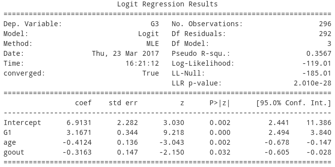

<!--
$theme: gaia
template: invert
-->

# Day 9: Classification Algorithms


---


### Why Classification?

To date, we have focused on *regression* algorithms. While useful, there is a critical feature of regression tools worth noting:

- Do not understand different "groups" of data when presented as a dependent variable, just one sliding scale in $\mathbb{R}$

---

### When Classification Instead of Regression?

When we have **discrete** dependent variables
- Binary variables
- Categorical Data
- When there is no clear dependent variable, or when we don't exactly know what we are looking for


---

### Regression vs Classification

Regression asks:

- What is the predicted price of commodity $x$ in the next period?

Classification asks

- Does the price of commodity $x$ rise or fall in the next period?

---

### Classification - Logistic Regression

<center>


</center>


---

### What about Linear Probability Models?

Good:
- Just use OLS to estimate likelihood of outcome
- Has the advantage of simplicity

Bad:
- Assumes continuity of outcomes (which is not true in a classification problem)

---

### What about Linear Probability Models?

<br>
Ugly: 

- Is not restricted to the $[0,1]$ interval!
- Can have meaningless probabilities (greater than 1, and less than 0)

---

### Logistic Regression

What if we transform our regression model in a way that requires it to remain within the $[0,1]$ interval?


---

### Logistic Regression

<br>

- We no longer have a linear function (linear functions are not bounded to our unit interval)
- We no longer assume that treatments have constant effect
- **But** our output can now be interpreted as 
$$p(y=1)$$


---

### Logistic Transformation

<br>

The transformation that is required in order to coerce our output to remain between 0 and 1 is

$$p(y=1|x)=\frac{exp(x'\beta)}{1+exp(x'\beta)} = \Lambda(x'\beta)$$

and is called the **logistic transformation**.

---

### Marginal Effects in a Logit Model

In order to obtain a point estimate of the marginal effect of a given input on $y$, we must use the function

$$\frac{\partial E(y|x)}{\partial x}= \Lambda(x'\beta)\cdot \left(1-\Lambda(x'\beta)\right) \cdot \beta $$

Thus, our marginal effects will depend on the values of our inputs.

**Note**: the Lambda ($\Lambda$) function is defined on the previous slide

---

### Marginal Effects in Regressions

**OLS**:

$$\frac{\partial E(y|x)}{\partial x}= \beta $$

**Logit**:

$$\frac{\partial E(y|x)}{\partial x}= \Lambda(x'\beta)\cdot \left(1-\Lambda(x'\beta)\right) \cdot \beta $$


---

### Implementing Logistic Regression

```python
import numpy as np
import patsy as pt
from bokeh.plotting import figure, show
from statsmodels.discrete.discrete_model import Logit

data = pd.read_csv('passFailTrain.csv')

y, x = pt.dmatrices('G3 ~ G1 + age + goout', data = data)

model = Logit(y, x)

reg = model.fit()

print(reg.summary())
```

---

### Implementing Logistic Regression

```python
import numpy as np
import patsy as pt
from bokeh.plotting import figure, show
from statsmodels.discrete.discrete_model import Logit
```

We need to import our libraries, and particularly, import the Logit function from the ```statsmodels``` library.

---

### Implementing Logistic Regression

```python
data = pd.read_csv('passFailTrain.csv')

y, x = pt.dmatrices('G3 ~ G1 + age + goout', data = data)
```

Recall that we generate our $y$ and $x$ matrices in order to use them in our model. Output goes on the left of the "~", inputs on the right, separated by "+" 

**Note:** this is also the formula that R uses when performing regressions.

---

### Implementing Logistic Regression

```python
model = Logit(y, x)

reg = model.fit()

print(reg.summary())
```

First, we create our Logit model, then we store the fitted model as ```reg```. Afterward, we can print out our summary table.

---

### Implementing Logistic Regression

It should look something like this:

<center>



</center>

---


### Predictions from Logit Model

Now, we may want to use our logit model to make predictions about new observations.

All we need are new values:
 
 New Observation: [Term 1 Grade: Pass, Age: 16, Frequency of Going Out: 4]
 
---


### Predictions from Logit Model

<br>

 ```python
 reg.predict((1,1,16,4))
# OR
xpred = pt.dmatrix('~ G1 + age + goout', data = testdata)
 ``` 
 
 <br>
 Note that we have to include values for all necessary variables, as well as a $1$ for the intercept term.
 

---

### Marginal Effects from Logit Model

```python
reg = model.fit() # We need to start with a fitted model

mEff = reg.get_margeff(
  at='overall', # Where the ME is estimated
  method='eydx', # Calculates d(ln y)/dx, or % effect
  dummy=True, # Caclulates effects on dummies as 0 to 1
  count=True) # Calculates effects on count as value + 1

mEff.summary()
```

Using the ``get_mareff`` method, we can easily estimate the marginal effects of our regressors on the dependent variable. (No ugly home-made functions needed!)

---


### Notes on $R^{2}$

While $R^{2}$ values are not always helpful in a regression setting, they are very valuable when forecasting using regressions.

- Tell us how much of the variance our model is capable of explaining
- If our $R^{2}$ is 0.3567 (like it was for the regression earlier), then the model explains 35.67% of the variation in pass/fail outcomes among students in our sample.
---


### Notes on $R^{2}$

Even **more** useful in a forecasting setting is the out-of-sample $R^{2}$

- Tell us how much of the variance our model is capable of explaining with respect to **new** observations
- Basically, it tells us if we are doing a good job creating accurate forecasts
 
 
---


### Generating a Tjur $R^{2}$

<br>

Since we cannot use the standard $R^{2}$ measure for Logit models, we need to calculate a pseudo-$R^{2}$, and ```statsmodels``` does not calculate out-of-sample $R^{2}$ automatically.

---


### Generating a Tjur $R^{2}$

Tjur (2009) suggested an $R^{2}$ measure for Logit models calculated as the difference between the mean value of predictions for "failures" and "successes" in a binary model.

$$Tjur\;R^{2} = \bar{\hat{y}}_{successes} - \bar{\hat{y}}_{failures}$$

<br>

$$Tjur\;R^{2} = \text{Mean prediction for successes}$$
$$ - \text{Mean prediction for failure}$$

---


### Generating a Tjur $R^{2}$

Tjur (2009) suggested an $R^{2}$ measure for Logit models calculated as the difference between the mean value of predictions for "failures" and "successes" in a binary model.

$$Tjur\;R^{2} = \bar{\hat{y}}_{successes} - \bar{\hat{y}}_{failures}$$

<br>

The measure is bounded by 1 and 0, and gives us a measure of how well we separate our two outcomes

---


### Lab for Today

1) Fit a Logit model predicting whether or not a student will receive a passing grade in term 3, using the data provided in passFailTrain.csv

2) Create a function that will take a fitted logit model, and y and x matrices, and return the Tjur $R^{2}$ value for that sample

3) Do your best to find a model with the **highest** Tjur $R^{2}$ value given the data that was provided to you (feel free to compare code and models with other groups!)
