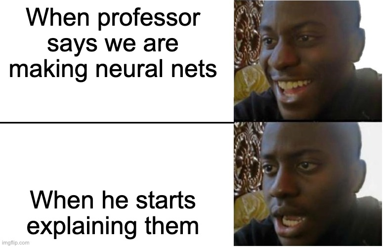
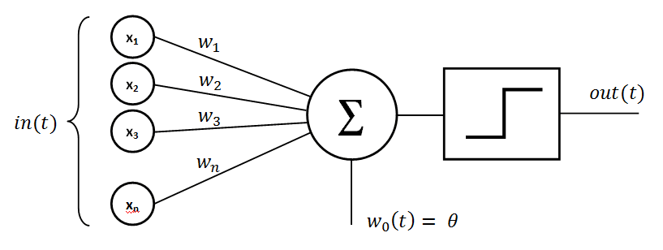
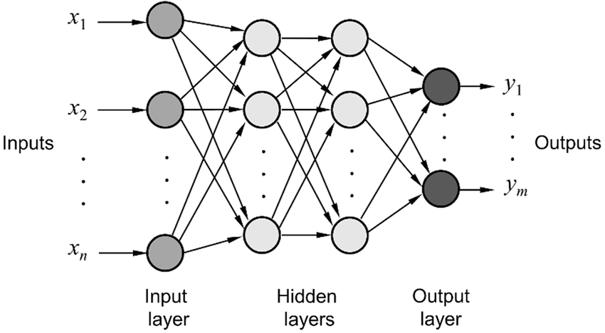
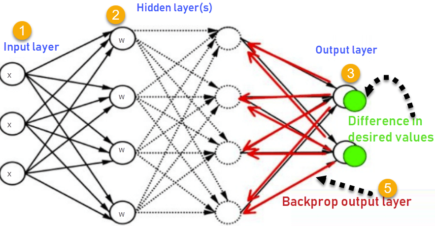

# Neural Networks

### For a great supplementary read, [check this out](https://writings.stephenwolfram.com/2023/02/what-is-chatgpt-doing-and-why-does-it-work/)!

---



---

# Why?

Neural networks are a class of **advanced** machine learning models originally designed to replicate many observed characteristics of human brains
- Hard to use well (see statement on brains)
- Difficult to explain clearly (see above)
- Highly valuable **in specific contexts**

---

# The basics - Perceptrons

A perceptron is the computational equivalent of a single neuron

Let's describe it with a visual

---

# A perceptron




---

# What is an Activation Function?

An activation function is a math function that determines when a perceptron moves from "off" to "on".

Again, let's describe this visually

---


---

# How does this make a Neural Network?

Neural networks are made up of **layers** of perceptrons that are interconnected, leading from the **input layer** to the **output layer**.

Any layer in between is called a **hidden layer**. Neural networks are often referred to as **deep learning** because of these hidden layers making the nerual network "deep".

---



---

# How do we use them?

Our goal with a neural network is to train our network with **weights** and **biases** (these are what trigger the activation functions, remember?) so that the network is able to represent the complex process of predicting our outcome of interest.

---

# How we learn - Backpropagation



---

# How we learn - Backpropagation

Through inputs and backpropagation, we train our model to perform as well as we can on our task.

How do we choose the right network?

---

# Choosing the right network

1. Use one that someone else designed for the same (or similar) tasks
2. Evolutionary algorithms ("neuroevolution")
    - Here's an example: https://www.youtube.com/watch?v=qv6UVOQ0F44
3. Trial and error, called neural architecture search (NAS), not efficient!
4. Searching the design space efficiently (AnyNet did this)

---

# Creating networks with `pytorch`

Why use `pytorch`?
- It is pythonic, so it makes sense (`tensorflow` feels like C++ and is really jarring for the typical Python user)
- It contains many prebuilt objects to speed up our construction
- Can easily be used with GPUs for acceleration of training (we won't do this in class, but it is trivially easy)

---

# Setting up

```pip3 install torch torchvision torchaudio```

`torch` is the core library, while `torchvision` and `torchaudio` support specific tasks

---

# Importing modules

```python
# For reading data
import pandas as pd
from torch.utils.data import Dataset
from torch.utils.data import DataLoader

# For visualizing
import plotly.express as px

# For model building
import torch
import torch.nn as nn
import torch.nn.functional as F
```

---

# Importing data

Using data in neural networks is not quite the same as using data for statistical models:
- Modern models have a LOT of parameters (ChatGPT-4 is believed to have over 1 TRILLION)
- We use **minibatches** of data to minimize memory use

We need to create a **class** object that can handle our data, and break it down as needed

---

# Defining our data class

While some data can be imported straight from `pytorch` through its data library, real-world work requires us to be able to work with ANY data, so we will practice setting up our data input manually.

---

# Defining our data class

```python
class CustomMNIST(Dataset):
    def __init__(self, url):
        # read in our raw data from the hosting URL
        self.raw_data = pd.read_csv(url)

    # return the length of the complete data set
    #   to be used in internal calculations for pytorch
    def __len__(self):
        return self.raw_data.shape[0]

    # retrieve a single record based on index position `idx`
    def __getitem__(self, idx):
        # extract the image separate from the label
        image = self.raw_data.iloc[idx, 1:].values.reshape(1, 28, 28)
        # Specify dtype to align with default dtype used by weight matrices
        image = torch.tensor(image, dtype=torch.float32)
        # extract the label
        label = self.raw_data.iloc[idx, 0]

        # return the image and its corresponding label
        return image, label
```

---

# Importing the data

```python
# Load our data into memory
train_data = CustomMNIST("https://github.com/dustywhite7/
Econ8310/raw/master/DataSets/mnistTrain.csv")
test_data = CustomMNIST("https://github.com/dustywhite7/
Econ8310/raw/master/DataSets/mnistTest.csv")

# Create data feed pipelines for modeling
train_dataloader = DataLoader(train_data, batch_size=64)
test_dataloader = DataLoader(test_data, batch_size=64)
```

---

# Data vs `DataLoader`

Data
- Data is contained in instances of the class that we designed
- Can be used in many different ways, and is very flexible

`DataLoader`
- Takes a data class, and is the pipeline to create **minibatches** of that data source to be used at each step of training
- Wraps the data with the necessary functionality

---

# Verify our data

```python
# Check that our data look right when we sample

idx=1
print(f"This image is labeled a {train_data.__getitem__(idx)[1]}")
px.imshow(train_data.__getitem__(idx)[0].reshape(28, 28))
```

Does the number look like the label? Then you've got it set up correctly!

---

# Building our first network

We are now ready to create a neural network using the data we have in memory!

In this case, let's walk through the most basic neural network that we can: a **linear neural network classifier**.

---

# Building our first network

Steps:
1. Create a class to hold our network
    - Can you tell that `torch` is really focused on using class objects? So was `sklearn`!
2. Initialize our model (`__init__`)
    - We create the layers of our model in this stage, by declaring each layer and attaching it to the class object we created in (1)
3. Declare our `forward` method
    - This is where we construct our model and describe how to move from one layer to the next

---

# Build it!

```python
class FirstNet(nn.Module):
    def __init__(self):
      # We define the components of our model here
      super(FirstNet, self).__init__()
      # Function to flatten our image
      self.flatten = nn.Flatten()
      # Create the sequence of our network
      self.linear_relu_model = nn.Sequential(
            # Add a linear output layer w/ 10 perceptrons
            nn.LazyLinear(10),
        )
```

---

# Build it!

```python
class FirstNet(nn.Module):
    ... # see last slide

    def forward(self, x):
      # We construct the sequencing of our model here
      x = self.flatten(x)
      # Pass flattened images through our sequence
      output = self.linear_relu_model(x)

      # Return the evaluations of our ten 
      #   classes as a 10-dimensional vector
      return output

# Create an instance of our model
model = FirstNet()
```

---

# Prepare to train the model

```python
# Define some training parameters
learning_rate = 1e-2
batch_size = 64
epochs = 20 

# Define our loss function
#   This one works for multiclass problems
loss_fn = nn.CrossEntropyLoss()
```

---

# More definitions

**Batch size**: The number of image samples provided at once to our model. We have to keep this relatively small, since it takes a lot of computer memory to train the models on a set of images.

**Epochs**: The number of times we will loop over the **entire data set** as we train our model. More epochs leads to more refined models, but also takes a long time.

**Learning Rate**: How fast our model changes as it adapts to its mistakes.

---

# Prepare to train the model

```python
# Build our optimizer with the parameters from
#   the model we defined, and the learning rate
#   that we picked
optimizer = torch.optim.SGD(model.parameters(),
     lr=learning_rate)
```

---

# Prepare to train the model

```python
def train_loop(dataloader, model, loss_fn, optimizer):
    size = len(dataloader.dataset)
    # Set the model to training mode
    # important for batch normalization and dropout layers
    # Unnecessary in this situation but added for best practices
    model.train()
    # Loop over batches via the dataloader
    for batch, (X, y) in enumerate(dataloader):
        # Compute prediction and loss
        pred = model(X)
        loss = loss_fn(pred, y)

        # Backpropagation and looking for improved gradients
        loss.backward()
        optimizer.step()
        # Zeroing out the gradient (otherwise they are summed)
        #   in preparation for next round
        optimizer.zero_grad()

        # Print progress update every few loops
        if batch % 10 == 0:
            loss, current = loss.item(), (batch + 1) * len(X)
            print(f"loss: {loss:>7f}  [{current:>5d}/{size:>5d}]")
```

---

# Prepare to train AND TEST the model

```python
def test_loop(dataloader, model, loss_fn):
    # Set the model to evaluation mode
    # important for batch normalization and dropout layers
    # Unnecessary in this situation but added for best practices
    model.eval()
    size = len(dataloader.dataset)
    num_batches = len(dataloader)
    test_loss, correct = 0, 0

    # Evaluating the model with torch.no_grad() ensures
    # that no gradients are computed during test mode
    # also serves to reduce unnecessary gradient computations
    # and memory usage for tensors with requires_grad=True
    with torch.no_grad():
        for X, y in dataloader:
            pred = model(X)
            test_loss += loss_fn(pred, y).item()
            correct += (pred.argmax(1) == y).type(torch.float).sum().item()

    # Printing some output after a testing round
    test_loss /= num_batches
    correct /= size
    print(f"Test Error: \n Accuracy: {
        (100*correct):>0.1f}%, Avg loss: {
            test_loss:>8f} \n")
```

---

# And now we train!

```python
# Need to repeat the training process for each epoch.
#   In each epoch, the model will eventually see EVERY
#   observations in the data
for t in range(epochs):
    print(f"Epoch {t+1}\n-------------------------------")
    train_loop(train_dataloader, model, loss_fn, optimizer)
    test_loop(test_dataloader, model, loss_fn)
print("Done!")
```

---

# Score the model

Take a look at the final testing score printed after the last epoch.

Does this model outperform our decision trees and random forests? Why?

---

# Making more predictions

```python
# Decide if we are loading for predictions or more training
model.eval()
# - or -
# model.train()

# Make predictions
pred = model(test_data.__getitem__(1)[0]).argmax()
truth = test_data.__getitem__(1)[1]
print(f"This image is predicted to be a {pred}, and is labeled as {truth}")
```

---

# Where are we now?

- We have created a linear neural network classifier
- This is the foundation of neural network architecture
    - It is about 40 years out of date, though
- Remember, neural nets are a CLASS of models
    - We will explore variants of neural networks over the next two weeks

---

# Before we go...

Training neural networks is time and computational resource intensive

According to [these redditors](https://www.reddit.com/r/GPT3/comments/p1xf10/how_many_days_did_it_take_to_train_gpt3_is/), it would take 355 years to train GPT-3 on a single NVIDIA Tesla V100 GPU

So let's save our progress so that we can import it later

---

# Saving a model

```python
# Save our model for later, so we can train more or make predictions

EPOCH = epochs
# We use the .pt file extension by convention for saving
#    pytorch models
PATH = "model.pt"

# The save function creates a binary storing all our data for us
torch.save({
            'epoch': EPOCH,
            'model_state_dict': model.state_dict(),
            'optimizer_state_dict': optimizer.state_dict(),
            }, PATH)
```

---

# Loading data back in

```python
# Specify our path
PATH = "model.pt"

# Create a new "blank" model to load our information into
model = FirstNet()

# Recreate our optimizer
optimizer = torch.optim.SGD(model.parameters(), lr=0.001, momentum=0.9)

# Load back all of our data from the file
checkpoint = torch.load(PATH)
model.load_state_dict(checkpoint['model_state_dict'])
optimizer.load_state_dict(checkpoint['optimizer_state_dict'])
EPOCH = checkpoint['epoch']
```

---

# Lab Time!

For homework assignment 3, you will work with [Fashion MNIST](https://github.com/zalandoresearch/fashion-mnist), a more fancier data set.
- You must create a custom data loader [2 points]
- You must create a working neural network using only `pytorch` [2 points]
- You must store your weights and create an import script so that I can evaluate your model **without training it** [2 points]

Highest accuracy score gets some extra credit!