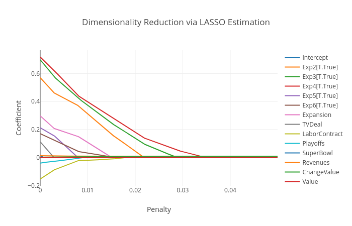
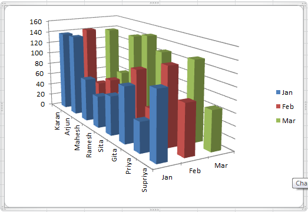

# Lasso and Feature Selection Models

---

# Lots of Variables

In predictive models, we frequently deal with huge numbers of variables

- When our data has lots of variables relative to the number of observations in our data set, we say that it is a **wide** data set
- When we have lots of observations relative to the number of variables, then the data set is said to be **long**

---

# Lots of Variables

When might we encounter **wide** data?

- New problems
- Problems that are observed with very low frequency
- Problems for which many variables are recorded


<br>

Consider the market for high-end homes. Why might we encounter wide data when trying to forecast prices for these homes?

---

# What is the Problem?

Why does it matter if we have too many variables?


---

# What is the Problem?

Why does it matter if we have too many variables?

- Too many variables $\implies$ mathematical problems with regression analysis
- We **violate our rank and order conditions**!

**Rank**: Number of linearly-independent vectors in our matrix (# of columns)
**Order**: Number of unique observations (# of rows)

---

# Rank and Order Condition

If our rank is $k$ and our order is $n$, then we need to satisfy the following condition

$$ n-1 \geq k $$

In order to complete our regression, we need **at least** one observation per variable, including our dependent variable.

Sometimes, we just don't have that much data.


---

# Choose Your Variables

How can we reduce the dimensionality of our problem in order to make predictions?


---

# Choose Your Variables

How can we reduce the dimensionality of our problem in order to make predictions?
- Use business/application understanding

---

# Choose Your Variables

How can we reduce the dimensionality of our problem in order to make predictions?
- Use business/application understanding
- Use feature selection models


---

# Choose Your Variables

How can we reduce the dimensionality of our problem in order to make predictions?
- Use business/application understanding
- Dimensionality reduction
- Use feature selection models


---


# Business and Application Understanding

There are **so** many reasons it matters, but it is especially important when working with wide data.
- Do I have intuition about which variables are most important?
- Are there variables I know I cannot omit from my model to ensure that it is valid (or ensure that it is accepted by policy-makers)?


---

# Reducing dimensionality via algorithms

We will discuss two ways of reducing the dimensionality of our data.

1. Dimensionality Reduction - We can also try to distill the information in our model to fewer columns, thereby reducing the number of overall variables.
2. Feature Selection Models - Some models can be tuned using a **regularization** term, in order to coerce them into using fewer terms


---

# Likelihood Review

Recall our likelihood function for OLS:

$$ ln(\theta|y, x) = -\frac{n}{2}ln(2\pi) -\frac{n}{2}ln(\sigma^2) - $$
$$\frac{1}{2\sigma^2}(y-x\beta)'(y-x\beta)  $$

Our goal is to find values of $\beta$ and $\sigma^2$ that will maximize our likelihood function, so that our model maximizes the amount of information extracted from our data. Let's call this function $L(\theta)_{OLS}$ from now on.

---

# Lasso Regression

To implement a Lasso regression, we introduce a **regularization** term to our likelihood function:

**Regularization**: the process of introducing additional information in order to solve an ill-posed problem (Wikipedia)

$$ L(\theta)_{LASSO} = L(\theta)_{OLS} - \lambda ||\theta||_1 $$

$||\theta||_1$ is the $l_1$ norm, or Manhattan distance function

---

# Lasso Regression

What good is our regularization term ($||\theta||_1$)?

- Larger coefficients lead to greater penalties on our likelihood function
- Reduces our model's "willingness" to use every variable
- Raising $\lambda$, our penalized likelihood function will drive some (eventually ALL) coefficients to 0!

---

# Lasso Regression



---
# Lasso Regression

1. Choose how many parameters we are willing to incorporate in our model
2. Increment by varying $\lambda$ until our model has the specified number of parameters!

---

# Lasso Regression

- Protects us to some extent from overfitting
- Allows the data to help us shape our model
- Still interpretable!
- Can be used with least squares AND with logistic regression models

---

# Implementing Lasso Regression

As we continue into predictive models, it's time to introduce our next library: `sklearn`.

```python
import pandas as pd
import numpy as np
from sklearn.linear_model import Lasso 
import patsy as pt

data = pd.read_csv("nflValues.csv")

eqn = '''np.log(OperatingIncome) ~ Expansion + Exp2 
+ Exp3 + Exp4 + Exp5 + Exp6 + TVDeal + LaborContract 
+ Playoffs + SuperBowl + Revenues + ChangeValue + Value'''

y, x = pt.dmatrices(eqn, data=data)
y = np.ravel(y) # Needed to prep for sklearn models
```

---


# Implementing Lasso Regression

```python
model = Lasso(alpha = (2/100))
reg = model.fit(x, y)

results = pd.DataFrame([reg.coef_], 
            columns = x.design_info.column_names, 
            index = ['Coefficients']
            ).T
```

Because `sklearn` is a *predictive* library, it does not generate results tables for us, like `statsmodels` does. We can always generate a table of results to be printed for ourselves, though.

---

# Classification & Lasso Regression

But wait! I wanted to use this model to predict binary outcomes!

> Great day! Regularization can also be applied to logistic regressions.

$$ L(\theta)_{LLASSO} = L(\theta)_{Logistic} - \lambda ||\theta||_1 $$

All we have to do is apply our $l_1$ penalty term to the logistic regression likelihood function!

---

# Lasso Regression Classifier

```python
from sklearn.linear_model import LogisticRegression \
                                 as Logit 

model = Logit(penalty = 'l1', C=1/0.05)
# C is an inverse penalty weight, so that
#   smaller C = larger penalty
reg = model.fit(x, y)

results = pd.DataFrame([reg.coef_], 
            columns = x.design_info.column_names, 
            index = ['Coefficients']
            ).T
```

---

# Lasso Review

- Can be applied to various regression models
    - Linear
    - Logistic
    - ANY OTHER MAXIMUM LIKELIHOOD MODEL
- Helps us to find the most important explanatory variables using a regularization term ($\lambda\cdot||\theta||_1$)

---

# Dimensionality Reduction

There are many dimensionality reduction tools outside of the regression paradigm. We will focus on **principal component analysis** (also called **PCA**).

Per `sklearn`, PCA is a "Linear dimensionality reduction using Singular Value Decomposition of the data to project it to a lower dimensional space."

Let's use some figures to get the idea...


---

# What about this plot is unnecessary?



---

# Dimensions and Principal Components

<br>


---

# Dimensions and Principal Components

PCA condenses the information contained in our $x$ matrix into fewer columns, arranging that information in a dense structure.

- No "information" is lost$^*$ through PCA
    - But you won't know which column provided information to each new variable, so PCA cannot generally be reversed

$^*$*In theory, no information is lost, but that isn't necessarily true in practice*

---

# Applying PCA to Data

```python
from sklearn.decomposition import PCA

pca = PCA(n_components=3)
pca.fit(x)

newX = pca.transform(x)
```

This process will find a 3-dimensional representation of our data, then transform our data to fit that new 3-dimensional space.

---

# PCA Summary

Using PCA, we can reduce the number of dimensions in our model, and then fit a predictor using the lower-dimension data.

- Does not lose information like Lasso regression (for the most part)
- Allows us to choose any number of dimensions for our data
- NOT interpretable! Only useful for prediction
- Can be used with any model type

---

# PCA Summary

I don't use PCA, because I dislike the loss of explanatory power. I find that dealing with models through regularization typically serves my goals better.

---

# Lab Time!

<!-- ---


### Lab for Today

1) Experiment with Lasso regressions (using OLS or Logit)

2) Explore your ability to reduce the dimensionality of your data with PCA.

3) Do your best to find a model with the **highest** Tjur $R^{2}$ value given the data that was provided to you (always feel free to compare code and models with others!) -->
