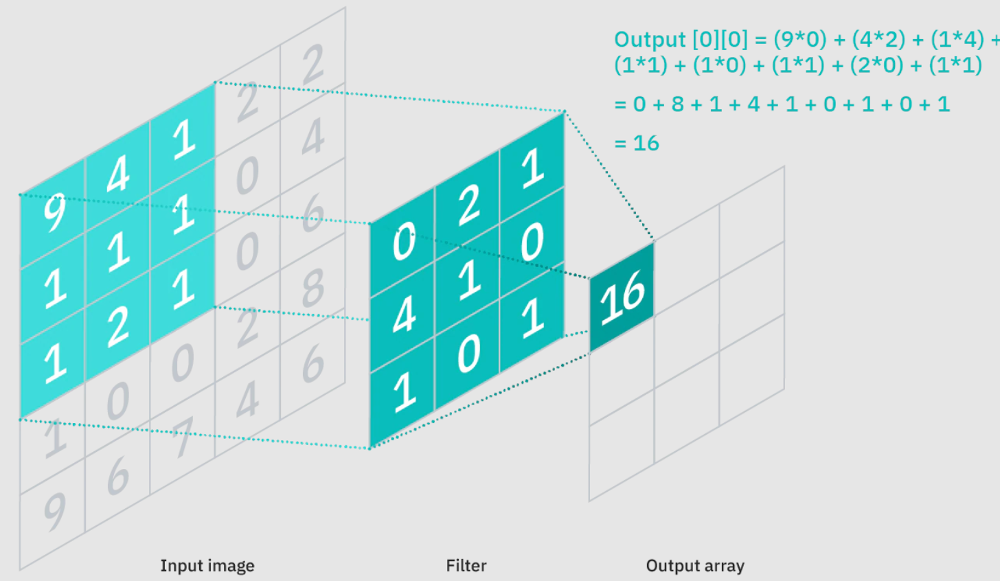
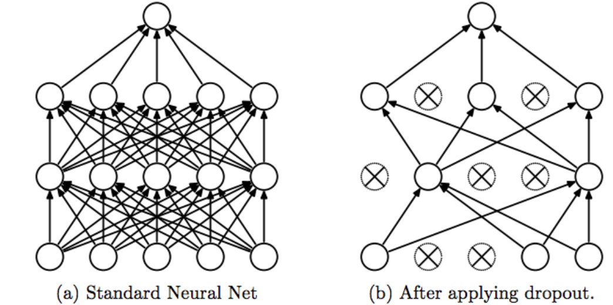

# From LeNet to ResNet

---

# From layers to blocks

The most notable change in neural networks over time is the increased levels of abstraction that are used to design more complex models
- Design individual perceptrons (neurons)
- Design individual layers
- Design blocks of layers with specialized properties

---

# First, important layer types

---

# Convolution



---

# Convolution

The goal of convolution is to try to extract patterns in our image through small-scale filters applied to each region of the image. This reduces the size of the image, but the result is a matrix of "pattern" data.

---

# Convolutional Parameters

**Padding** - How many additional pixels do you want to add around the edge of your image in order to preserve dimensionality? Choose a number, and that is your padding value

**Stride** - How many pixels should you move to the side before calculating the next convolution? That is your stride length

---

# Pooling


---

# Pooling

Pooling is a simple compression of the data, with our options being to average the value of a group of pixels, or to take the maximum value of the grouped pixels

**Reduces the dimensionality of our data**

---

# Dropout



---

# Dropout

In a neural network, it is common for each neuron in one layer to connect to **every neuron in the next layer**. This is called a **fully connected** layer. In order to avoid overfitting, dropout "unplugs" a random percentage of neuron connections. The dropped connections are chosen randomly.

**ONLY DONE DURING TRAINING**

---

# LeNet (1998)


---

# Making LeNet

Let's try to make it and train it using our MNIST data. For comparison, here is a [torch tutorial making the same thing](https://pytorch.org/tutorials/beginner/blitz/neural_networks_tutorial.html)

---

# Making LeNet

We will use the functions we built last week, and that I have included in [this script](https://github.com/dustywhite7/Econ8310/blob/master/Code/nnhelpers.py), so that we can just focus on building the network itself.

Just put it in your working directory, and we can import the functions to save time!

---

# Making LeNet

```python
# For reading data
from torch.utils.data import DataLoader

# For visualizing
import plotly.express as px

# For model building
import torch
import torch.nn as nn
import torch.nn.functional as F

# Import helpers
import nnhelpers as nnh
```

---

# Making LeNet

```python
# Still loading the same data as last week!
# Load our data into memory
train_data = nnh.CustomMNIST("https://github.com/dustywhite7/
Econ8310/raw/master/DataSets/mnistTrain.csv")
test_data = nnh.CustomMNIST("https://github.com/dustywhite7/
Econ8310/raw/master/DataSets/mnistTest.csv")

# Create data feed pipelines for modeling
train_dataloader = DataLoader(train_data, batch_size=64)
test_dataloader = DataLoader(test_data, batch_size=64)
```

---

# Making LeNet

```python
class LeNet(nn.Module):

    def __init__(self):
        super(LeNet, self).__init__()
        # 6 output channels, 5x5 square convolution
        # kernel
        self.conv1 = nn.LazyConv2d(6, 5, padding=2)
        self.conv2 = nn.LazyConv2d(16, 5)
        # an affine operation: y = Wx + b
        self.fc1 = nn.LazyLinear(120)  
        self.fc2 = nn.LazyLinear(84)
        self.fc3 = nn.LazyLinear(10)
```

---

# Make LeNet happen

```python
class LeNet(nn.Module):
    ...

    def forward(self, x):
        # Max pooling over a (2, 2) window
        x = F.max_pool2d(F.relu(self.conv1(x)), (2, 2))
        # If the size is square, you can specify with a single number
        x = F.max_pool2d(F.relu(self.conv2(x)), 2)
        # flatten all dimensions except the batch dimension
        x = torch.flatten(x, 1) 
        x = F.relu(self.fc1(x))
        x = F.relu(self.fc2(x))
        x = self.fc3(x)
        return x
```

---

# Make LeNet happen

```python
# Create a model instance, pass the model to GPU
model = LeNet().to('cuda')
```

Then, we train!

```python
model = nnh.train_net(model, train_dataloader, 
        test_dataloader, epochs = 5, learning_rate = 1e-3,
        batch_size=64
        )
```

---

# Evaluation

My model had mostly pleateaued after 45 epochs, and reached a test accuracy of ~93%

- Could use complete MNIST to do better (only using 1/12 the training data currently)
- Could keep training to achieve higher accuracy

---

# What happened next?

Networks following LeNet simply added more convolutional layers followed by pooling in a repeated pattern, adding depth to the networks in an attempt to increase accuracy.

---

# Going further - Blocks

- **Blocks** offer a new level of abstraction beyond layers, and consist of repeating layer sequences that perform specific tasks
- We will discuss a few of these block structures this week, and add some more next week

---

# VGG Blocks

- Block structure: (Multiple consecutive convolutions, ReLU) + Pooling
- Innovation: Maintain image resolution by stacking convolutions and activations prior to pooling, so that more levels of heirarchical convolution (and more nonlinearity) can be included in the model

---


---

# Network in Network Blocks

- Block structure: (Convolution/ReLU, 1x1 Convolution/ReLU, 1x1 Convolution/ReLU) + Pooling
- Innovation: 1x1 Convolutions allow for connections across channels, creating more deeply connected networks without overwhelming memory constraints

---


---

# Inception Blocks

- Block structure: Multiple processing streams, with each using different convolution sizes to look at traits of varying resolution, each resulting in output of the same shape as the input, concatenated into channels based on streams
- Innovation: 

---

# Inception Blocks


---

# Inception Block Code

```python
class Inception(nn.Module):
    # c1--c4 are the number of output channels for each branch
    def __init__(self, c1, c2, c3, c4, **kwargs):
        super(Inception, self).__init__(**kwargs)
        # Branch 1
        self.b1_1 = nn.LazyConv2d(c1, kernel_size=1)
        # Branch 2
        self.b2_1 = nn.LazyConv2d(c2[0], kernel_size=1)
        self.b2_2 = nn.LazyConv2d(c2[1], kernel_size=3, padding=1)
        # Branch 3
        self.b3_1 = nn.LazyConv2d(c3[0], kernel_size=1)
        self.b3_2 = nn.LazyConv2d(c3[1], kernel_size=5, padding=2)
        # Branch 4
        self.b4_1 = nn.MaxPool2d(kernel_size=3, stride=1, padding=1)
        self.b4_2 = nn.LazyConv2d(c4, kernel_size=1)

    def forward(self, x):
        b1 = F.relu(self.b1_1(x))
        b2 = F.relu(self.b2_2(F.relu(self.b2_1(x))))
        b3 = F.relu(self.b3_2(F.relu(self.b3_1(x))))
        b4 = F.relu(self.b4_2(self.b4_1(x)))
        return torch.cat((b1, b2, b3, b4), dim=1)
```

---

# GoogLeNet (2014)


---

# Residual Blocks

- Block structure: Special case of inception block with only two streams. The streams represent the neural network equivalent of Boosted Tree models
- Innovation: Model the error of the current stage, and continue to create blocks to predict error in order to add it up and make a stronger prediction

---

# Residual Blocks:


---

# Residual Blocks:


---

# ResNet (2016)


ResNet is still actively used, being considered easy to implement and close to the state of the art

---

# Building ResNet-18

Let's make a small version of ResNet (ResNet-18) from scratch. An importable and pre-trained version can be found [here](https://pytorch.org/hub/pytorch_vision_resnet/).

*Note: The original model uses color images in three channels, but we are still using MNIST, so our network will be slightly different*

---

# Building ResNet-18

```python
class Residual(nn.Module):
    """The Residual block of ResNet models."""
    def __init__(self, num_channels, use_1x1conv=False, strides=1):
        super(Residual, self).__init__()
        self.conv1 = nn.LazyConv2d(num_channels, kernel_size=3, padding=1,
                                   stride=strides)
        self.conv2 = nn.LazyConv2d(num_channels, kernel_size=3, padding=1)
        if use_1x1conv:
            self.conv3 = nn.LazyConv2d(num_channels, kernel_size=1,
                                       stride=strides)
        else:
            self.conv3 = None
        self.bn1 = nn.LazyBatchNorm2d()
        self.bn2 = nn.LazyBatchNorm2d()

    def forward(self, X):
        Y = F.relu(self.bn1(self.conv1(X)))
        Y = self.bn2(self.conv2(Y))
        if self.conv3:
            X = self.conv3(X)
        Y += X
        return F.relu(Y)
```

---

# Building ResNet-18

```python
class ResNet(nn.Module):
    def __init__(self, arch, lr=0.1, num_classes=10):
        super(ResNet, self).__init__()
        self.net = nn.Sequential(self.b1())
        for i, b in enumerate(arch):
            self.net.add_module(f'b{i+2}', 
                self.block(*b, first_block=(i==0)))
        self.net.add_module('last', nn.Sequential(
            nn.AdaptiveAvgPool2d((1, 1)), nn.Flatten(),
            nn.LazyLinear(num_classes)))

    def b1(self):
        return nn.Sequential(
            nn.LazyConv2d(64, kernel_size=7, stride=2, padding=3),
            nn.LazyBatchNorm2d(), nn.ReLU(),
            nn.MaxPool2d(kernel_size=3, stride=2, padding=1))
```

---

# Building ResNet-18

```python
class ResNet(nn.Module):
    ...

    def block(self, num_residuals, num_channels, first_block=False):
        blk = []
        for i in range(num_residuals):
            if i == 0 and not first_block:
                blk.append(Residual(num_channels,
                 use_1x1conv=True, strides=2))
            else:
                blk.append(Residual(num_channels))
        return nn.Sequential(*blk)

    def forward(self, x):
        x = self.net(x)
        return x
```

---

# Building ResNet-18

```python
class ResNet18(ResNet):
    def __init__(self, lr=0.1, num_classes=10):
        super(ResNet18, self).__init__(((2, 64), (2, 128),
         (2, 256), (2, 512)),
                       lr, num_classes)

model = ResNet18().to('cuda')
```

Again, it's time to train!

```python
model = nnh.train_net(model, train_dataloader, 
        test_dataloader, epochs = 5, learning_rate = 1e-3,
        batch_size=64
        )
```


---

# Lab Time!