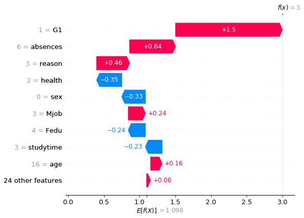
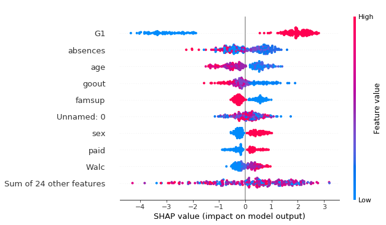

# Boosted Trees :evergreen_tree::rocket:

---

# Refresh: Bagging vs Boosting
What's the difference?

---

# Refresh: Boosting

If we boost an algorithm using $M$ stages, then we need to define $f_m(x)$ at each stage.

$$ \hat{f}_0(x) = 0 $$

At each subsequent stage, we solve for

$$ \hat{f}_m(x) = \hat{f}_{m-1}(x) + f^*_m(x) $$

So that each stage adds more information to our model.

---

# Boosting through selection of trees

- A random forest improves accuracy by forcing trees to take different shapes
- **Boosted tree models** improve accuracy by finding trees that fill our knowledge gap

---

# Example: your wardrobe :shirt::scarf::coat::dress:

When you shop, do you buy the same colors and the same patterns over and over?


---

# Example: your wardrobe :shirt::scarf::coat::dress:
When you shop, do you buy the same colors and the same patterns over and over?

NO!

We choose clothes that fit the gaps in our wardrobe (different occasion, different color, different weather, etc.)

---

# Doing the same for trees :evergreen_tree:

Instead of just checking information gain, boosted trees

1. Compare information gain
2. Compare complexity

And choose the best tree to supplement the existing mix

---

# Introducing XGBoost

eXtreme Gradiant Boosting


---

# Using XGBoost

First, you might need to install it:
```py
!pip install xgboost
```

---

# Get some data and load libraries

```py
import pandas as pd
import xgboost as xgb

data = pd.read_csv('https://github.com/dustywhite7/
Econ8310/raw/master/DataSets/passFailTrain.csv')

y = data['G3']
x = data.drop('G3', axis=1)

test_data = pd.read_csv('https://github.com/dustywhite7/
Econ8310/raw/master/DataSets/passFailTest.csv')

yt = test_data['G3']
xt = test_data.drop('G3', axis=1)
```

Don't let your training data touch your testing data!

---

# Prep data for the XGBoost model

```python
dtrain = xgb.DMatrix(x, label=y)
dtest = xgb.DMatrix(xt)
```

`xgboost` requires data to be passed into a special `DMatrix` object (that is NOT the same as the `patsy` objects)

---

# Specify parameters and train the model

```python
params = {
    'max_depth':10, 
    'eta':0.5, # metric for reducing overfitting
    'objective':'binary:logistic'
}

model = xgb.train(params, dtrain, 20)
# 20 is the number of boosting rounds undertaken by the model
```

A [full explanation of available parameters](https://xgboost.readthedocs.io/en/stable/parameter.html)

---

# Make predictions, check accuracy

```python
from sklearn.metrics import accuracy_score

preds = model.predict(dtest)
preds_bin = [int(i>0.5) for i in preds]

print(f"Accuracy {round(accuracy_score(yt, preds_bin),2)}")
```

`Accuracy 0.84`

---

# Cool, but what do we understand?

The model is pretty opaque! Maybe we can squeeze some more useful information out of it...

---

# `shap` for explaining models

First, install/upgrade [shap](https://shap.readthedocs.io/en/latest/index.html):
```py
!pip install --upgrade shap
!pip install --upgrade numpy=1.20
```
 (you might need to restart your kernel and rerun your code)

 ---

 # Making a plot

```python
import shap
from shap.plots._waterfall import waterfall_legacy

# Parse our model to prep for explanation
explainer = shap.TreeExplainer(model)
shap_values = explainer.shap_values(x)

# Make the plot
waterfall_legacy(explainer.expected_value, shap_values[0], x.loc[0,:])
 ```

 The three arguments to the plot:
 - Baseline value for the model (`explainer.expected_value`)
 - Explanation of a single observation (`shap_values[0]`)
 - array containing column names (`x.loc[0,:]`)

 ---

 

---

# Plotting the entire dataset

```python
shap.plots.beeswarm(explainer(x))
```

While the waterfall plot is useful for explaining how an individual observation was modeled, it can also be beneficial to see the patters in the whole data set.

---



---

# Why visualize?

Using SHAP visualizations, we are able to make some progress in explaining black-box algorithms. We don't know WHY these variables mattter, but we can at least see the variables that are determining outcomes.

---

# Lab Time!